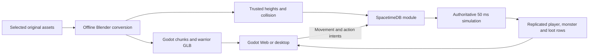

# Architecture

The game uses **standard Godot 4.7.2/GDScript** and a **Rust SpacetimeDB 2.8.3
module**. The database owns identity, presence, positions, terrain height,
collision, attacks, health, respawn, gold and item instances. Clients send intents and render
subscribed state. This is a new game protocol, without compatibility with the
original Metin2 executable.

SpacetimeDB provides transactions, persistence, identity and subscriptions.
Movement, content validation, combat rules and reward ownership are project code.

## Shared map content

The [map pipeline](map-import.md) resolves original source records at pinned
revisions, converts geometry in background Blender, and builds Godot scenes.
`tools/bake_yongan.py` reads the same heights, source attributes, water and
authored model collision. It writes ignored server content plus client collision
metadata. `server/src/content.rs` embeds that data at build time with the
`yongan` feature; reducers never read host files or invoke Blender/Godot.

Water blocks movement only where its surface reaches above at least one terrain
corner, using the same four-corner rule as the rendered water mesh. Water records
wholly buried below dry terrain do not add invisible blocking. Original terrain
blocking attributes and authored model collision remain independent constraints.

Yongan spans 1024 × 1280 meters in map-local positive X/Z coordinates. Source
centimeters `(x,y,z)` become Godot meters `(x,z,-y)/100`. The bake includes a
two-meter terrain grid, one-meter movement attributes, transformed collision
shapes and authored elevated floor triangles. The server uses the terrain
mesh's triangle diagonal for height interpolation and the highest applicable
authored surface for bridges/platforms. This is not general multi-floor
navigation: it cannot choose independently between overlapping traversable
levels at one X/Z coordinate.

Client chunk scenes contain terrain and authored walk-surface colliders for
click picking. Building blocking remains a server rule. Both map identity and
content hash are advertised by `world_info`; native metadata and the browser
manifest must match before entry. The scheduled simulation refreshes this row
from compiled metadata after module publication, preserving characters. The
pinned SpacetimeDB 2.8.3 module has no update lifecycle hook, so the scheduled
refresh handles same-map content updates. Changing map identity requires a new
database or an explicit migration. The separate map-preview remains an inspector
with no multiplayer connection.

Without the Cargo feature, the server uses the small flat training ground with
five box obstacles. Make enables Yongan by default; raw Cargo has no default
feature. Both builds expose the same version-2 schema.

## Networking and runtime boundaries

The pinned [native GDScript SDK](https://github.com/flametime/Godot-SpacetimeDB-SDK/tree/f6c59d7068e5dacbde0559906746d0a6c5933ffb)
is vendored in `client/addons/SpacetimeDB`, plugin version **0.3.2**. Tested
compatibility is this exact SDK, Godot 4.7.2 and SpacetimeDB 2.8.3.

The socket subprotocol is `v3.bsatn.spacetimedb`. In the pinned server,
[wire protocol v3](https://github.com/clockworklabs/SpacetimeDB/blob/v2.8.3/crates/client-api-messages/src/websocket/v3.rs)
coalesces messages using the
[v2 binary schema](https://github.com/clockworklabs/SpacetimeDB/blob/v2.8.3/crates/client-api-messages/src/websocket/v2.rs).
This transport version is separate from application
`world_info.protocol_version = 2`, checked before joining.

Decoding runs on the main thread, with no compression and
`confirmed_reads = false`. Cached tables require primary keys; Brotli is
unsupported. Local SDK changes have [separate provenance](../client/addons/SpacetimeDB/UPSTREAM.md).
The standard engine and pure GDScript path support Web without a .NET dependency.

| Location | Responsibility |
| --- | --- |
| `server/src/lib.rs` | Player/session tables, controlling connection, reducer validation, scheduled movement, chat |
| `server/src/movement.rs` | Direction, speed and training-ground sweep/sliding rules |
| `server/src/content.rs` | Trusted terrain, map bounds, building/water blocking and elevated surfaces |
| `server/src/combat.rs` | Monster simulation, attacks, health, death/respawn and loot |
| `server/src/inventory.rs` | Item ownership, grid placement, equipment, consumables and item drops |
| `client/scripts/net/game_connection.gd` | SDK lifecycle, tokens, version checks, subscriptions and dictionary signals |
| `client/scripts/main.gd` | Input, entity instances, loading, camera and HUD |
| `client/scripts/actors/` | Interpolated warriors and procedural monster/loot visuals |
| `client/scripts/world/world_stream.gd` | Content manifest, downloaded packs, nearby chunk instances |
| `client/scripts/ui/classic_*.gd` | Original UI art/layout, inventory slots, taskbar, tooltips and minimap presentation |
| `tools/export_playable.py` | Isolated Web/Linux builds and optional test-only probes |
| `deploy/`, `tools/deploy.py` | Isolated Docker services, HTTPS/WSS and deployment |

Gameplay code consumes dictionaries and calls `GameConnection` methods. SDK
resources, generated bindings and authentication tokens stay behind that
boundary. `client/spacetime_bindings/` is generated, not manually maintained.

## Application contract

Positions are meters with Y up, heading is radians about Y, and activity is
`0 = idle`, `1 = moving`, `2 = attacking`, `3 = dead`.

| Public table | State |
| --- | --- |
| `player` | Identity primary key; name; X/Y/Z and heading; activity/online; attack sequence; health/max health; gold; respawn deadline |
| `monster` | Numeric ID; X/Y/Z and heading; health/max health; activity; attack sequence; respawn deadline |
| `loot` | Auto-increment ID; X/Y/Z; gold; owner identity; reservation and expiry deadlines |
| `inventory_item` | Auto-increment ID; owner identity; item vnum; count; bag cell; equipped flag |
| `item_drop` | Auto-increment ID; X/Y/Z; vnum/count; owner identity; reservation and expiry deadlines |
| `world_info` | ID, protocol version, map display name, map ID, content hash, tick interval and legacy half-size |
| `obstacle` | Training-ground box IDs, centers, extents, height and visual kind |
| `chat_message` | Auto-increment ID; sender, server-copied name, message and timestamp |

The client subscribes to online players, monsters, gold/item drops, inventory,
world information, training obstacles and retained chat. `inventory_item` is a
public prototype table; the UI filters to the local owner, but this is not
inventory-read privacy. Reducers still validate ownership before every mutation.
There is no spatial subscription filtering.
Yongan's actual bounds come from baked content, not the legacy `half_size`
field. Display names confer no ownership or authorization.

| Reducer | Behavior |
| --- | --- |
| `enter_world(name)` | Validate a 2–16 character name; create/resume one character per identity; acquire its controlling connection |
| `set_move_input(dx, dz)` | Validate finite components in [-1, 1]; store direction for scheduled movement |
| `move_to(x, z)` | Validate a finite destination against trusted bounds and blockers |
| `stop_moving()` | Clear held/destination movement |
| `perform_attack()` | Enforce cooldown, stop movement, replicate animation and damage an eligible nearby enemy |
| `pickup_loot(id)` | Validate a living controlling player, distance, clear path, expiry and reservation; grant gold and delete loot atomically |
| `move_item(id, cell)` | Validate ownership, bag footprint, page bounds and empty destination cells |
| `equip_item(id)` | Validate a single sword, move it to the weapon slot and return any previous weapon to a fitting bag location |
| `unequip_item(id, cell)` | Validate the equipped item and a fitting unoccupied bag destination |
| `use_item(id)` | Validate an owned potion, living/injured player and cooldown; heal and consume one atomically |
| `pickup_item_drop(id)` | Validate distance, height, clear path, reservation, expiry and bag capacity; grant/stack the item and delete the drop atomically |
| `send_chat(message)` | Validate 1–160 printable characters, rate-limit to one per second and retain the latest 100 |

Private tables hold socket sessions, controlling connections/input, simulation
time, scheduled ticks, monster attack clocks and inventory initialization/potion
cooldowns. Simulation accepts only the
scheduler's identity. Gameplay actions require the controlling socket, and
movement/attacks/pickups reject dead characters.

## Movement and combat

The server ticks every **50 ms**, caps movement integration at **100 ms**, and
limits speed to **5 m/s** with normalized diagonals. Held input expires after
600 ms; clients refresh it every 100 ms. A 0.45 m character radius contributes
to collision checks. Yongan travel is split into small steps with axis sliding,
height-change limits and terrain/model blocking. Destinations do not determine
the player's Y; the server computes it.

Click movement is a straight destination vector, not a pathfinder. There is no
local position prediction, reconciliation system, player-to-player collision
or general layered navigation. Local and remote visuals interpolate toward
replicated three-dimensional positions.

The prototype Stone Sentinel is procedural geometry, not an imported Metin2 mob.
A player hit deals 25 base damage plus 10 for the equipped starter sword, within
2.7 m and a 2 m height difference, with a
clear path and an 850 ms cooldown. The sentinel has 100 health, chases eligible
nearby players around its home, and deals 20 damage within 1.9 m every
1.3 seconds. These are prototype rules, not an original-game balance claim.

A defeated sentinel respawns after 12 seconds and drops five gold plus one red
potion. Gold and item drops have separate authoritative rows. Both remain
reserved for the slayer for 10 seconds, expire after 60 seconds, and require
a pickup within 2.5 m with compatible height and clear path. An atomic reducer
deletes the loot and credits the player, preventing duplicate grants. A dead
player respawns after 8 seconds at the town spawn with full health and retained
gold. Reconnecting does not bypass death or attack deadlines.

## Inventory and original UI

The inventory slice is additive: the existing `Player`, `Monster`, `Loot` and
world schema remain unchanged. Application protocol stays at version 2, while
new clients require the added item tables/reducers and regenerated bindings.
Publish that module before running the new client; an older database without
the additional tables cannot satisfy its subscriptions.

`inventory_state` marks once-only initialization and stores the potion cooldown.
On first entry each identity receives one sword (`vnum=10`) and five red potions
(`vnum=27001`); entry/reconnect never grants another starter set. Existing guest
characters receive their first set when they enter after publication.

The bag has 90 cells in two 45-cell pages, each five columns by nine rows.
Items occupy one column: the sword is two cells tall and a potion one. A sword
cannot wrap across a page boundary; the server checks every occupied cell.
Potions stack to 200, swords to one. The equipment slot uses cell 255 as a
server sentinel; its original artwork is 32 × 96 pixels, while the sword's
32 × 64 icon still occupies only two bag cells. Equipping grants the server
damage bonus without yet adding a 3D sword attachment to the warrior.

A red potion heals up to 40 HP with a one-second cooldown. Full-health use,
dead-player use, wrong ownership and unsupported item types fail without
consumption. Item pickups respect the same 10-second reservation, 60-second
expiry, 2.5 m reach and compatible height/clear-path rules as the gold loop.
Stack filling and new-cell allocation occur in the same reducer transaction as
drop deletion, so a full bag cannot partially consume a reward. Inventory,
equipment and cooldown state survive death/reconnect; there is no player-driven
item deletion, trading or arbitrary item/currency grant endpoint.

The UI uses selected original raster artwork converted by
`tools/import_metin_ui.py`: 159 UI images and one Yongan map assembled from 20
original minimap tiles, using 207 pinned source files. Source resolution and
alpha are preserved. Layout
references guide the 176 × 565 inventory, 37-pixel taskbar, eight visible
quickslots and minimap. See [UI assets](ui-assets.md) for provenance and limits.

Mouse carry/drag sends normal item reducers; slots redraw from subscribed state
after acceptance. `I` opens inventory, right click equips/uses, `1–4` and
`F1–F4` activate quickslots, and `Ctrl+F3` opens developer inspection. Quickslot
bindings, selected pages and inventory-window position are local UI preferences
scoped to the character profile; they confer no item ownership or permission.

Original UI fidelity is a target. Login is still a prototype, unsupported
character/skills/social controls are inactive, and neither font rendering nor
complete behavior has been compared with a running original client. The
inventory introduces a narrow weapon/consumable loop, not a complete original
equipment or progression system.

## Original map and chat panels

`classic_map_panel.gd` separates the small minimap from the original atlas.
The minimap uses the 1024 × 1280 stitched tiles, original player/other-player
marker art and subscribed positions; close/reopen and zoom are interactive.
`M` or the minimap atlas button opens the separate original 171 × 214 atlas
inside a 186 × 252 draggable window. M, Escape and its close button dismiss it.
The atlas shows the local player; it does not invent absent NPC/warp data.
Unsupported maps disable the atlas and zoom controls.

`classic_chat.gd` places a 600-pixel ordinary chat entry at the horizontal center,
62 pixels above the viewport bottom. Passive messages fade after five seconds
or once they are older than the four newest, with a time-based decay. Enter
opens entry; submitting nonempty text sends a normal server intent, clears the
field, releases both chat inputs and closes ordinary entry. Empty Enter also
closes ordinary entry. Up/Down recalls locally sent text, and Escape cancels it.
World left/right clicks release chat focus before movement or camera handling.
The submission event is consumed before focus changes so the root Enter
shortcut cannot reopen chat. Typing still owns input while active, preventing
I/M/L and movement keys from also triggering game controls. Returning to
movement after sending is the requested usability behavior; it deliberately
differs from the original source's keep-editing behavior.

`L` or the chat-history button opens a draggable, resizable log with original
title and scrollbar parts. The client presents subscribed chat messages;
the server still accepts only normal chat, limits messages to 160 characters,
rate-limits submission and retains 100 rows. An original 300-line reference
does not imply server-side 300-line persistence or implemented party/guild/
whisper/shout channels. Unavailable channel controls stay inactive.

The UI asset manifest includes decoded RGBA hashes. Import settings prevent
lossy compression, mipmaps and alpha-border modification, and exported-PCK
audits compare every UI texture's loaded pixels to those hashes. This checks
texture preservation, not full original font/layout behavior. The source's
Tahoma GDI sizes are documented; no font has been added or redistributed.

## Loading and identity lifecycle

Connection advances through `connecting`, `subscribing`, optional `loading`,
`joining`, then `connected`. Content is prepared after world metadata arrives
and before the normal join reducer. Failures clear stale snapshots; reconnect
constructs a fresh SDK instance/cache. If map identity/content changes while
loading, joining or connected, the client disconnects with a refresh/restart
notice. It does not keep playing against different collision data.

Web exports use a core PCK plus a shared scenery pack and 20 section packs.
The manifest and SHA-256 filenames tie downloads to their content; the loader
checks hashes before mounting packs without replacement of mounted resources.
The pack generator includes feature-specific imported texture dependencies as
well as default resource remaps. Numeric terrain tile/attribute textures use
lossless import without mipmaps or GPU compression, preserving each ID/bit.
Every section is audited in a fresh Godot process with only its shared and
section packs; the audit compares exported numeric texels against the source
PNGs and checks shader, layered textures and textured prop dependencies.

The loader refuses to combine a new scenery manifest with already mounted
packs. A refresh/restart loads a coherent set after an update. Browser HTTP
responses are validated after browser decompression, then saved and closed
before cache-file hashing and mounting.
Nearby sections are requested around the player and distant scene instances
are released. Downloaded files may remain cached; unloading a scene is not a
promise that every engine resource or mounted pack has left memory. Initial
engine/core/shared/start-area loading still exists. Background section loading
and browser reconnect are verified. The corrected public browser build also
passed rendered terrain and keyboard combat checks. See
[distribution](distribution.md#verification-status).

Browser identity tokens use the SDK's WebSocket query-token path because the
browser cannot set arbitrary handshake headers. HTTPS/WSS and disabled URL
logging keep tokens out of proxy request logs. Desktop uses authorization
headers. Tokens live under `user://identities/`, scoped by endpoint, database
and local profile; they are absent from reports and packages. Browser storage
depends on the browser retaining the origin's site data.

A duplicate socket cannot displace an active controller. Its rejected join and
disconnect leave the original player online. Disconnecting the controller
stops movement and removes online presence while preserving character state.
These are guest identities, not an account/character-selection system.

## Protocol changes and evidence

Publish a compatible module to the intended database, regenerate `make bindings`,
then update the wrapper, client and live smoke tests together. Use a new database
or deliberate migration for incompatible changes. The generator fetches
`/v1/database/…/schema?version=10` and records the schema/SDK/generated-file hashes.
`--offline` uses the saved schema. Increase the application version when the
contract becomes incompatible.

The completed Yongan baseline has 16 Rust tests, 22 live SDK multiplayer checks
and 19 combat checks in `.local/yongan-network-final.json` and
`.local/yongan-combat-final.json`. Real exported Web/Linux tests cover both the
training ground and Yongan. Yongan's 26-check real-GPU browser run covers mutual
rendered movement, background sections, keyboard movement/attacks/loot, monster
and player death/respawn, rejection, reconnect/refresh and identity/position
preservation across database-container replacement, with no engine errors.
The report and screenshots are in `.local/browser-proof/20260906-161458/`.
All 20 section packs also pass isolated resource loading and exact numeric
texture-byte audits. Separate normal Web/Linux release checks confirm direct
browser UI/keyboard movement, correct textures, mutual presence and absent test
hooks; evidence is in `.local/release-browser/` and `.local/release-native/`.
The inventory extension has 20 passing Yongan Rust tests (14 in training), four
UI conversion tests, a repeated 22-check movement smoke in
`.local/inventory-movement-smoke.json`, and 56 live inventory checks in
`.local/inventory-smoke.json`. Those include ownership/grid rejection, equipment
damage, potions, item-drop reservation/stacking, and death/reconnect persistence.
Publishing additively to an existing test world preserved all four player rows
exactly, including identity, position, health and gold; the before/after evidence
is `.local/inventory-migration-before.txt` and `inventory-migration-after.txt`.
Native MCP inspection confirms I opens inventory and right click equips the
sword through the server. The first original-HUD release then passed 39 public
Chrome/Linux checks in `.local/browser-proof/20260906-165921/report.json`, including
inventory input, quickslots, refresh, combat and item pickup. Its published
development build intentionally retains the user-authorized fixed test probe.
The area-map/chat pass has 15 UI, 17 map and 22 chat native component checks.
Its real Chrome/Linux loopback run passed 45 checks in
`.local/browser-proof/20260906-174144/report.json`, with no browser engine errors.
The run covers map/chat dragging and resizing, bottom-center chat, delivery to
the other subscription, and WASD after send, Escape, world click and chat-history
submission, plus rejection and reconnect/refresh/disconnect behavior. The runner
waits for stopped subscribed state and visual interpolation before comparing
reconnected positions. Fresh Web/Linux test PCKs verify all 160 UI/map images
against exact RGBA hashes; their file inventories contain 582/1,385 entries.
Public release `20260906T154235134255Z` then passed 45 core/panel/inventory
checks in `.local/browser-proof/20260906-174806/report.json`, with no browser
engine errors. Its served manifest equals the exported Web manifest. Public
checks exercise chat open/cancel and panel controls; actual message delivery and
post-send WASD remain the separately verified loopback paths. Native editor
inspection of the connected public game also confirms bottom-center entry and
Escape leaving chat unfocused and hidden.
These checks do not establish full-game fidelity, a large
player-count target or native Windows execution.
See [distribution](distribution.md#verification-status) for current export
evidence and remaining limits.
