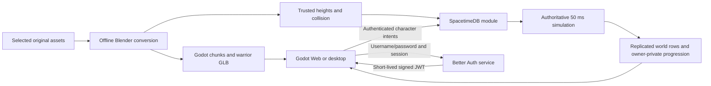

# Architecture

Compiled monster placements retain their `definition_vnum` alongside instance ID
and home coordinates. The population parser validates membership in an explicit
registry of distinct positive vnums, preserving mixed definitions rather than
collapsing every row to one species. The current build supplies only the existing
ordinary mob vnum; the authored training target has its own typed placements.
Monster creation uses the placement's definition ID, and combat validates that
persisted identity against its compiled spawn. This internal build contract adds
no database columns or reducers; protocol 18 remains unchanged. The converted
wildlife registry still needs stats, action and reward integration.

Physical combat now resolves ordinary attacker and defender stats by trusted
definition vnum and actor ID. The installed registry still contains only Wild
Dog; the offline wildlife compiler validates five candidate definitions without
installing an incomplete gameplay catalog. Normal mob critical hits have a
bounded percentage roll and checked damage doubling. Skill critical probability
is a separate mechanic; these rules do not implicitly enable it.

Ordinary mob spawning, health/level validation, movement and attack timing,
XP/gold rewards, respawn, defending spheres and GREAT-hit recovery now consume
`MobDefinition` records. The registry currently wraps the existing compiled dog
fixture without changing its balance. Simulation rejects inconsistent persisted
stats/presentation instead of resetting every ordinary actor to the dog's level.
The dummy remains a separate validated passive definition. Original passive AI,
item drop tables and the five-species catalog are not enabled by this refactor.

Ordinary mob definitions now contain bounded weighted attack lists. The server
selects one entry at action acceptance and publishes its exact ID; the same entry
supplies duration, cooldown and pending hit window. Resolution looks up that ID
within the actor's own definition, rather than using a default species attack.
Weights must total 100; duplicate IDs, unsupported action features and invalid
timing reject. A one-entry list does not consume a selection RNG draw. The current
installed dog remains a 100-weight single action until the matching multi-variant
content package is integrated. This internal change adds no protocol fields.

Classic class presentation and combat share the installed character catalog
(see [characters](characters.md)). The common Sword+0 and Fan+0 chains resolve each step
from the server-owned character appearance and captured weapon vnum. All eight
appearances use the shared queue, target, equipment and action-revision checks.
The class profile selects a starter weapon; creation validates that item and
its registered attack before granting it transactionally. Physical weapon class
selects the corresponding victim resistance. The item registry supplies runtime
weapon power; the older pinned Sword arithmetic record remains a reference.
Held Space is a client intent scheduler; it cannot choose damage or bypass those
checks. The original common-chain registrations and bounded action timings are
compiled into the server, while intro-only preview models use `intro.wait`.

Player attack timing uses a server-captured `attack_speed_percent` in each public
Player action and its private Controller. The private progression projection's
`display_attack_speed` instead reflects current equipment. Base speed is 100;
selected Sword+0/Fan+0 applies add 22/26 points, with a player cap of 170. Item
registry schema 2 imports these values from the pinned proto. No reducer accepts
client-supplied speed. Protocol 15 and trusted content schema 8 require matching
bindings, generated metadata and exports.

Source motion times remain immutable. At action start, the server converts clip,
hit-window, fresh-cooldown, combo-input, root-motion and area-activation times
using `ceil(source_us * 100 / captured_speed)`. The client uses the same integer
rule for held input and camera activation; animation playback and late-subscription
seeking use `captured_speed / 100`. Idle, damage and death playback reset to 1.
Equipment changes update future speed without changing an active action's clocks.
Existing captured weapon/revision checks still cancel invalid combo links.

Root endpoints, ordinary-hit invulnerability, mob attack timing, knockback distance
and duration, and 200 ms area/camera effect lifetimes remain unchanged. This clock
contract follows the original client's precise playback factor, intentionally
avoiding the legacy server `CalculateDuration` helper's coarse integer-percent
rounding. Slows, buffs, other equipment applies and attack-speed-derived DPS parity
with the full original system remain outside this selected slice.

The game uses **standard Godot 4.7.2/GDScript** and a **Rust SpacetimeDB 2.8.3
module**. The database owns identity, presence, positions, terrain height,
collision, attacks, health, respawn, gold and item instances. Clients send intents and render
subscribed state. This is a new game protocol, without compatibility with the
original Metin2 executable.

SpacetimeDB provides transactions, persistence, identity and subscriptions.
Movement, content validation, combat rules and reward ownership are project code.

Stationary NPC placement follows the original NPC exception: coordinates and
terrain height must be finite and within the map, but the point need not be
walkable. The shared `valid_npc_position` function is used at server initialization
and by the offline catalog inspector. Mob spawning and player movement retain
their collision checks. This does not add a client placement reducer.

Protocol 18 adds public `npc_spawn` rows for original rectangular NPC areas.
Catalog schema 3 separates fixed placements from bounds and retry intervals.
The reducer draws inclusive centimetre coordinates, tries terrain validation at
most sixteen times, and draws an integer heading only after success. Successful
rows persist by spawn ID; private retry rows postpone failed placement attempts
by the source interval. Player reconnects do not modify these rows. Godot loads
the same catalog, validates incoming actor IDs/bounds/headings and instantiates
area actors only on loaded terrain chunks. Disconnect clears its replica cache.
These stationary residents have no combat/death or client reroll interface.

Choosing an NPC sends the existing clear-combat-target intent before approach.
When accepting a new NPC conversation, the server also clears the controller's
target and its private target view in the same transaction as the interaction.
The client displays the subscribed result; it does not clear authoritative state
optimistically. A rejected interaction does not clear the server target as a
side effect of that rejected reducer.

This page describes the implemented prototype. The
[full-game design](rebuild/architecture-and-delivery.md) separately proposes
module boundaries, state machines, modern replication/privacy contracts and
delivery phases. Its [feature catalog](rebuild/feature-catalog.md) records the
original-source requirements and dependencies; proposed boundaries are not
implemented capabilities.

Content generalization follows the
[extensible authoring contract](rebuild/content-authoring.md): typed, versioned
item/quest/mob/class definitions select shared server mechanics. The first item
registry now drives inventory placement, stacking, equipment requirements,
weapon power and gradual recovery. Mutable item instances remain server-owned;
general quest, mob and class registries and quest execution remain pending.

## Shared map content

The [map pipeline](map-import.md) resolves original source records at pinned
revisions, converts geometry in background Blender, and builds Godot scenes.
`tools/bake_yongan.py` reads the same heights, source attributes, water and
authored model collision. It writes ignored server content plus client collision
metadata. `server/src/content.rs` embeds that data at build time with the
`yongan` feature; reducers never read host files or invoke Blender/Godot.

Water blocks movement only where its surface reaches above at least one terrain
corner, using the same four-corner rule as the rendered water mesh. Water records
wholly buried below dry terrain do not add invisible blocking. Original terrain
blocking attributes and authored model collision remain independent constraints.

Yongan spans 1024 × 1280 meters in map-local positive X/Z coordinates. Source
centimeters `(x,y,z)` become Godot meters `(x,z,-y)/100`. The bake includes a
two-meter terrain grid, one-meter movement attributes, transformed collision
shapes and authored elevated floor triangles. The server uses the terrain
mesh's triangle diagonal for height interpolation and the highest applicable
authored surface for bridges/platforms. This is not general multi-floor
navigation: it cannot choose independently between overlapping traversable
levels at one X/Z coordinate.

Client chunk scenes contain terrain and authored walk-surface colliders for
click picking. Building blocking remains a server rule. Both map identity and
content hash are advertised by `world_info`; native metadata and the browser
manifest must match before entry. The scheduled simulation refreshes this row
from compiled metadata after module publication, preserving characters. The
pinned SpacetimeDB 2.8.3 module has no update lifecycle hook, so the scheduled
refresh handles same-map content updates. Changing map identity requires a new
database or an explicit migration. The separate map-preview remains an inspector
with no multiplayer connection.

Without the Cargo feature, the server uses the small flat training ground with
five box obstacles. Make enables Yongan by default; raw Cargo has no default
feature. Both normal builds expose the same current protocol-14 schema.

## Authored population boundary

`content/worlds/*.population.json` separates spawn placement from combat logic.
`server/build_population.rs` validates references and stable spawn IDs, producing
the typed home records consumed by combat, targeting, AI and respawn. The offline
Rust inspector calls the server's terrain and collision code; initialization
repeats home validation. Yongan's six development Wild Dogs use the existing
combat handler. This adds no wire fields or client-granted positions.

Population changes require a fresh database until an explicit migration tool is
implemented. General mob definitions and authorized live spawn controls remain pending. The separate Godot world preview renders actors at
validated coordinates and has no server connection. See
[world-content authoring](world-content.md).

Stationary NPC presentation uses a separate public catalog of stable actor/spawn
IDs, model references, weighted idle variants and per-map placements. The compiler
verifies conversion receipts, resolves positions with the same Rust terrain code,
and binds each layout to the map content hash. `WorldNpcs` runs in the normal Main
scene: it loads only the selected map's models, instantiates NPCs over available
chunks, removes them as chunks unload, and clears on leave/disconnect/reconfigure.
Repeated entry cannot duplicate an actor. Training intentionally has no original
NPC layout. A missing or mismatched Yongan catalog prevents world entry.

NPC catalog schema 2 explicitly distinguishes `animated` and `static` models.
Static definitions have no idle clips or AnimationPlayer; animated definitions
retain weighted original idles. The loader also accepts legacy schema 1, where
every definition is animated. The existing catalog hash gates matching builds;
the resource filename stays `catalog.v1.json` for path compatibility.

NPC presentation remains immutable. A picking-only body uses layer 2 with mask
zero; it is excluded from movement collision. The client reserves a click and
sends ordinary movement until its subscribed position is within 4.5 meters,
then requests `interact_npc(spawn_id, catalog_hash)`. WASD, another click,
Escape, attack, content unload, rejection or a 20-second timeout cancels the
reservation. There is no new pathfinder: a blocked approach can time out.

The game build joins `content/worlds/yongan.interactions.json` to the installed
offline NPC catalog. Names and positions come from the same immutable content;
interaction kinds/text come from the tracked profile. `world_info.npc_catalog_hash`
binds the client to the exact catalog bytes before entry. The server embeds the
resolved definitions; it never reads a catalog supplied by a connected client.
Static spawn IDs identify those compiled instances, so no mutable NPC table is
needed for this slice. The selected handler is `dialogue`; unknown kinds fail
compilation. Shops and quests are not implemented by this handler.

`interact_npc` validates the active controlling connection, living character,
compiled NPC existence/catalog, five-meter horizontal distance, three-meter
height tolerance, and the existing server path-blocking test. It rejects an
unfinished attack and stops movement on acceptance. The five-meter NPC click
rule follows pinned client `InstanceBaseBattle.cpp`; server validation and the
4.5-meter approach margin are our implementation choices. The greeting is
newly authored development text, not an original quest script.

`npc_interaction` is filtered by server-enforced account ownership and contains
the active character, unique auto-incremented session ID, NPC ID, title/body and
60-second deadline. Duplicate opens preserve the existing session and expiry.
Closing requires the current character's exact session ID, so an old or foreign
close cannot dismiss a newer conversation. Accepted movement/attack, leave,
disconnect, death, expired accounts, out-of-range movement or session expiry
remove it. Reentry starts without a conversation. Future commerce actions must
validate their own session and transaction rules; this dialogue grants no items,
currency, permissions or rewards.

## Networking and runtime boundaries

The pinned [native GDScript SDK](https://github.com/flametime/Godot-SpacetimeDB-SDK/tree/f6c59d7068e5dacbde0559906746d0a6c5933ffb)
is vendored in `client/addons/SpacetimeDB`, plugin version **0.3.2**. Tested
compatibility is this exact SDK, Godot 4.7.2 and SpacetimeDB 2.8.3.

The socket subprotocol is `v3.bsatn.spacetimedb`. In the pinned server,
[wire protocol v3](https://github.com/clockworklabs/SpacetimeDB/blob/v2.8.3/crates/client-api-messages/src/websocket/v3.rs)
coalesces messages using the
[v2 binary schema](https://github.com/clockworklabs/SpacetimeDB/blob/v2.8.3/crates/client-api-messages/src/websocket/v2.rs).
This transport version is separate from application
`world_info.protocol_version = 12`, checked before joining.

Decoding runs on the main thread, with no compression and
`confirmed_reads = false`. Cached tables require primary keys; Brotli is
unsupported. Local SDK changes have [separate provenance](../client/addons/SpacetimeDB/UPSTREAM.md).
The standard engine and pure GDScript path support Web without a .NET dependency.

| Location | Responsibility |
| --- | --- |
| `server/src/lib.rs` | Character-keyed player/session tables, reducer validation, scheduled movement, chat |
| `server/src/accounts.rs` | Trusted JWT claims, account roster/selection, connection leases and inventory read filters |
| `auth/` | Better Auth HTTP service, account sessions, signed JWTs, persistent SQLite and signing keys |
| `server/src/movement.rs` | Direction, speed and training-ground sweep/sliding rules |
| `server/src/content.rs` | Trusted terrain, map bounds, building/water blocking and elevated surfaces |
| `server/src/combat.rs` | Monster simulation, attacks, health, death/respawn and loot |
| `server/src/targeting.rs` | Private selected-target state, owner-only projection, churn limits and cleanup |
| `server/src/combo.rs` | Private four-step combo chain, input classification, queued transitions and cancellation |
| `server/src/root_motion.rs` | Server-owned combo displacement, canonical stepping and collision consumption |
| `server/src/inventory.rs` | Item ownership, grid placement, equipment, consumables and item drops |
| `server/src/progression.rs` | Source-backed Warrior stats, experience quarters, levels and stat allocation |
| `server/src/admin.rs` | Default-deny progression capabilities, private feedback, receipts and audit records |
| `client/scripts/net/game_connection.gd` | Typed account/gameplay facade, SDK lifecycle, version checks and subscription dictionaries |
| `client/scripts/net/account_auth.gd` | Same-origin auth HTTP requests and private remembered-session storage |
| `client/scripts/net/account_flow.gd` | Entry screens, availability, selection, logout and JWT refresh/reconnect |
| `client/scripts/main.gd` | Input, entity instances, loading, camera and HUD |
| `client/scripts/actors/` | Interpolated generated-GLB Warrior/Wild Dog actors, equipment attachment and loot visuals |
| `client/scripts/world/world_stream.gd` | Content manifest, downloaded packs, nearby chunk instances |
| `client/scripts/ui/classic_*.gd` | Original UI art/layout, inventory slots, taskbar, tooltips and minimap presentation |
| `tools/export_playable.py` | Isolated Web/Linux builds and optional test-only probes |
| `deploy/`, `tools/deploy.py` | Isolated Docker services, HTTPS/WSS and deployment |

Gameplay code consumes dictionaries and calls `GameConnection` methods. SDK
resources, generated bindings and authentication tokens stay behind that
boundary. `client/spacetime_bindings/` is generated, not manually maintained.

## Accounts and application contract

Better Auth **1.7.3** handles username/password registration and login, session
validation, password hashing and rate limiting. Its separate Node **24.20.0**
service uses SQLite and persistent signing material under `/data`. Registration
collects an email address, but this milestone sends no verification/recovery
email. Account recovery, social login and an account dashboard are deferred.
See [the auth service contract](../auth/README.md).

RS256 game JWTs contain only issuer, audience, opaque account subject, issue time
and expiry. The production issuer is `https://kcanakdag.com:8443/auth`, audience
`mt2-game`, and lifetime five minutes. The host verifies signatures through the
issuer's discovery/JWKS endpoints; the module separately requires the exact
issuer, audience and unexpired credential when connecting and acting.
`MT2_AUTH_ISSUER` overrides the trusted issuer at compile time for local tests.
Remembered account sessions last up to 30 days. Logout revokes the auth session
and disconnects the client; an already issued JWT remains valid until expiry.

An SDK caller identity identifies the account. `player.identity`, item owners,
loot owners and controllers identify a persistent character. New character IDs
are domain-separated deterministic identities derived from account and slot;
names confer no ownership. `GameConnection.account_identity` and
`local_identity` expose these two different concepts to the client.

| Table | State and visibility |
| --- | --- |
| `account_character` | Character Identity primary key; account, slot, name, empire, `character_class`, sex; owner-only RLS |
| `account_state` | Account Identity primary key; selected-character Identity (ZERO when unset), in-world flag; owner-only RLS |
| `player` | Public character Identity primary key; name, X/Y/Z, heading, activity/online, action and life sequences, health/max health, gold, respawn and current-action timestamps; offline rows also readable |
| `player_appearance` | Presence-only character projection with empire, class, sex and equipped weapon vnum; inserted on entry and removed on leave/expiry/disconnect |
| `monster` | Numeric ID; Wild Dog definition identity/model/motion/action and authoritative level, position, heading, health, activity, action and life sequences, respawn and current-action timestamps |
| `loot` | Numeric ID; position, gold, owner character, reservation and expiry |
| `inventory_access` | Character-to-account mapping; public with a strict account-only read filter |
| `inventory_item` | Numeric instance/stack ID; owner character, server-assigned account, vnum, count, revision, bag cell, equipped flag; account-owned rows only through RLS |
| `item_audit` | Private append-only quantity events, linked inventory/drop IDs, character/account, before/after counts, item revision and server cause/time |
| `item_drop` | Numeric ID; position, vnum/count, owner character, reservation and expiry |
| `character_progression` | Character Identity primary key; owner account, level/current and next experience, quarter step, unspent points, base stats, random HP/SP growth and SP totals; owner-only RLS |
| `combat_target_view` | Character Identity primary key; owner account and selected monster ID/life sequence only; owner-only RLS |
| `command_feedback` | Bounded account-private command result stream ordered by server ID; owner-only RLS |
| `world_info` | Protocol, map identity/content hash, trusted action profile/hash, tick interval and legacy half-size |
| `simulation_clock` | Public authoritative tick timestamp used to seek late-joined action clips |
| `obstacle`, `chat_message` | Training obstacles and retained normal chat |

The pinned `unstable` RLS feature filters inventory directly with
`inventory_item.account = :sender`. The server assigns this indexed account
field from the character's `inventory_access` record when granting an item;
clients cannot provide or change ownership. The access mapping has its own
strict `account = :sender` filter. An account can read its characters' items,
including inactive characters, but can act only as its selected active
character. This is independent of client-side filtering. Roster and selection
filters also select the authenticated caller's account. The direct filter
avoids a join that the actual 2.8.3 subscription engine rejected even with the
join columns indexed. Two real authenticated accounts exercise the HTTP service,
Godot SDK and SpacetimeDB together, including raw subscribed roster, state,
access-map, inventory and progression privacy, four-slot creation, rejected
foreign actions, switching and reconnect. The retained guest-enabled disposable
world has separate historical inventory evidence. See
[verification evidence](distribution.md#verification-status).

Read privacy covers account-to-character mappings, account state, inventory
access mappings, inventory rows, character progression, selected combat targets
and command feedback.
Private operator receipts, rate state, capabilities, audits and monster-damage
ledgers are not product subscriptions. The public `player` table has no
server-enforced online-only filter: other authenticated accounts can read offline
character names, positions, health and gold. The client's online-only query
controls presentation, not access. Owner RLS checks account identity alone.
JWT expiry rejects gameplay reducers and removes active presence, but revoking
already-established read subscriptions at expiry or logout has not been
demonstrated. A stale same-account socket may retain reads unless the host
closes it; this is a source-review concern, not a reproduced runtime result.

The lobby subscribes to the private account roster, selection, progression and
command feedback. Those owner subscriptions remain active during world play so
status and command results do not need an overlapping world subscription. World
entry adds online players, monsters, drops, inventory, map information and chat;
leaving unsubscribes that world state. No spatial interest filtering exists yet.
Yongan bounds come from baked content rather than the legacy `half_size` field.

| Reducer | Behavior |
| --- | --- |
| `open_account()` | Validate credentials and acquire one controlling connection per account |
| `create_character(slot, name)` | Enforce four slots (0–3), unique case-insensitive 2–16-character names; create male warrior in empire 1 and once-only starter items |
| `select_character(character_id)` | Require ownership; atomically leave any active character and update selection |
| `enter_selected_character()` | Acquire the selected character controller and enter the world |
| `leave_world()` | Stop movement, remove online presence and return to selection |
| `set_move_input(dx, dz)`, `move_to(x, z)`, `stop_moving()` | Validate finite/ranged movement intents and trusted collision |
| `perform_attack()` | Start an eligible attack or classify the next server-timed input in the bounded Sword+0 combo |
| `select_combat_target(target_id, target_life_sequence)`, `clear_combat_target()` | Select an exact live monster generation or clear presentation without accepting client position, health, name or level |
| `pickup_loot(id)`, `pickup_item_drop(id)` | Validate owner/reservation, range, expiry and capacity; grant rewards atomically |
| `move_item`, `equip_item`, `unequip_item`, `use_item` | Require active character/account ownership and exact expected item revision; validate placement and consumable rules |
| `allocate_stat(character_id, stat_code)` | Require the currently selected in-world character, ownership, live controller and an unspent point; accept only `st`, `ht`, `dx` or `iq` |
| `request_command_help(request_id)` | Return bounded owner-private help without writing synthetic public chat |
| `admin_grant_progression_xp(request_id, amount_text)`, `admin_raise_progression_level(request_id, target_text)` | Require a fixed server-side capability and active selected character; validate bounded decimal text, rate limits and replay-safe request identity before applying the normal progression kernel |
| `send_chat(message)` | Validate 1–160 printable characters, one message per second, retain latest 100 |

Private `session` and `account_control` tables bind authenticated accounts to
sockets. Character-keyed controllers retain attack/chat, target-change and
fresh-action deadlines across switching and reconnect. Combo transitions
revalidate the exact live session, account ownership, controlling connection,
unexpired lease and selected in-world character. A second socket cannot control
the same account or evict its current character on disconnect. Expired account
leases stop active presence. Scheduled simulation accepts only the database
scheduler's identity; movement, attacks and pickups reject dead characters.

Public account builds reject guest credentials. `enter_world(name)` remains
only for disposable legacy tests with compile-time `MT2_ALLOW_GUESTS=1`.
The current public P1 development route uses `mt2-p1-v4`; the preceding
`mt2-accounts-v3` account database and old `mt2-yongan-v2` guest database remain
stored without exposing their gameplay routes. No guest claim or migration API
is implemented. Protocol 6 target development uses a new database until a
deliberate migration and compatible public client are ready. Deployment
preserves existing data.

## Movement and combat

The server ticks every **50 ms**, caps movement integration at **100 ms**, and
limits speed to **5 m/s** with normalized diagonals. Held input expires after
600 ms; clients refresh it every 100 ms. A 0.45 m character radius contributes
to collision checks. Yongan travel is split into small steps with axis sliding,
height-change limits and terrain/model blocking. Destinations do not determine
the player's Y; the server computes it.

Click movement is a straight destination vector, not a pathfinder. There is no
local position prediction, reconciliation system, player-to-player collision
or general layered navigation. Local and remote visuals interpolate toward
replicated three-dimensional positions.

The selected fixture is original Wild Dog vnum 101 with trusted actor, model,
motion-set and action IDs. Protocol 10 calculates physical damage from canonical
stats and generated weapon/mob definitions. The initial Warrior deals 17, 18 or
20 damage with Sword+0, or 1 through 5 unarmed, against this dog. The dog deals
29, 30, 32, 33 or 35 against the initial Warrior. The source-ordered calculation
retains binary32 rounding, the selected attack-rating policy and the low-damage
floor. Critical hits, penetration, skills and general bonus systems remain outside
this selected fixture. Wild Dog health remains the explicit 100-HP test override.
Player reach remains 2.7 m with a 2 m height difference and clear path; the general
cooldown is 850 ms. Dog reach and cooldown remain 1.9 m and 1.3 seconds.

The build requires the generated, ignored
`server/content/p0-warrior-dog/actions.v1.json`, verifies its canonical SHA-256
definition hash and emits typed Rust constants. Player and dog hits resolve only
inside the selected source-derived microsecond window. Target life generations,
window expiry and consumed pending state prevent delayed actions from hitting a
new respawn or applying twice. Equipment and damage are frozen when the server
accepts the action. The general attack retains its 850 ms cooldown. A generated
combo action keeps a durable fresh-action deadline at the later of its cooldown
and clip end; only a valid step-1 follow-up bypasses that deadline.

Each simulation tick collects due player and monster hits into one global queue
and orders them by the authoritative source hit timestamp before applying
movement or monster AI. An exact timestamp tie resolves player hits before
monster hits, then uses player identity or monster ID as a stable tie key. Before
consuming a queued hit, the server reads the source's current pending action,
life generation and controller state again. An earlier death, leave, respawn or
replacement action therefore cancels a later copied event, while valid events
retain their expiry and exactly-once consumption rules.

Protocol 6 adds bounded monster targeting without changing the argument-free
attack intent. The private controller stores the exact monster ID/life pair, a
checked 64-bit revision and a checked server-time change deadline. The client
receives only its `combat_target_view` row. The public monster row supplies the
authoritative level used by the target board; the client does not hardcode
`Lv.1`.

Selecting the same live target succeeds and extends the one-second deadline.
Changing to another target before that deadline rejects. Clearing succeeds
immediately and increments the revision, but does not shorten the deadline, so
clear/reselect and reconnect cannot bypass the churn limit. Missing or stale
monster generations reject without consuming the deadline. Death, target life
change, character switching, leave, disconnect and re-entry clear the private
projection while preserving any future deadline held by the controller.

An explicit target locks the next accepted swing to that exact monster
generation even when another enemy is nearer. Authoritative range, height and
path checks still run at the captured hit time; an out-of-range selected target
misses without falling back. With no selected target, the established nearest
eligible attack remains available. A successful fallback hit publishes that
victim only as a best-effort presentation update when the target is still
clear, the captured revision still matches and the deadline has elapsed.
Failure of that presentation update never reverses valid damage. Equipment,
action, target generation, damage and range remain captured at swing start;
selecting or clearing during the swing changes later attacks only.

Normal builds retain one map-native Wild Dog. The server-only
`MT2_COMBAT_TEST_FIXTURE=dual-wild-dog-v1` selector compiles the reviewed
training fixture with two copies of the same definition at separate trusted
homes and advertises `training-v2-dual-wild-dog-v1`. Each monster's AI leash,
return and respawn use its own private trusted home. Any other selector fails,
and the dual fixture is rejected with `yongan`; an ordinary all-features build
with no selector remains valid. The fixture is only for disposable two-client
target-locking QA and adds no spawn reducer or player privilege.

The accepted local default-deny run in
`.local/p2-target/targets-root-reconnect-fixed-20260907.json` passed all 53
checks against the dual fixture. Two authenticated clients proved owner privacy,
far-target locking with a nearer in-range candidate, fallback presentation,
clear/select during a pending hit, the target deadline across a sub-850 ms
same-JWT reconnect, natural target respawn and both target-life and owner-death
cleanup. That focused headless run does not cover a real JWT refresh timer or
the full `AccountFlow`; the separate exported progression run covers those
lifecycle paths. Protocol 6 remains local and does not replace the public P1
route.

The protocol-6 client derives its selected monster only from the owner-matching
private projection and requires the same public monster ID and life generation
before showing the target board or attached target effect. The board uses the
public authoritative level, name and health. A ray-verified actor click sends
selection without moving; a ground click and WASD preserve the accepted target,
and the board close sends clear without movement. Space retains the established
no-selection attack behavior and uses the exact accepted target when one exists.
Pointer selection without automatic chase is an intentional interim boundary.
Hover and accepted-target visuals are distinct source-derived effects attached
to the exact actor generation; death or a new life detaches both, while an
accepted target can survive temporary stream visibility changes. Actual
exported Web/Linux verification passes 174 checks in
`.local/p2-target/browser-root-final-20260907/report.json`. The bounded run uses
real canvas input and the native probe's fixed input allowlist, kills one Wild
Dog life with four ordinary 25-damage attacks, observes its production respawn
in 11.946 seconds, and covers privacy, target churn, movement, death/new-life
cleanup, character/account lifecycle and both real refresh timers. This remains
local instrumented evidence; it does not qualify the public route, Windows, an
original-client visual comparison or queued combos.
The root acceptance record in `.local/p2-target/root-acceptance-review.json`
binds the 175 unchanged client sources, 17 server source hashes, three module
artifacts and both accepted instrumented PCKs.

Protocol 7 adds one bounded source-timed link for the male Warrior with Sword+0.
The trusted schema contains the first two declared one-hand actions and their
normalized input timings. `perform_attack()` still accepts no client action,
target or timestamp. For `combo_1`, receipt through 167094 microseconds rejects
as early; the first accepted input through 533333 queues a transition; an
unqueued receipt through 602564 transitions immediately. A queued transition
starts `combo_2` on the first simulation tick strictly after the direct-input
boundary, using that actual tick as its public start. Duplicate, late and
third-step input rejects without rewriting the action or pending hit.

The private controller keeps checked 64-bit action and chain revisions, the
exact captured target ID/life and equipped item ID/vnum, and a queue boundary.
Pending hits remain separate snapshots. Due hits resolve before combo
transitions, and both event types re-read their revision and timestamp keys.
Changing target, clearing target, accepted movement or an actual equipment
change cancels only a queued link; same-target renewal and rejected or
idempotent mutations preserve it. Accepted movement is recorded immediately,
while the existing simulation rule holds locomotion through the active attack
window. Death and account/character lifecycle cleanup clear the whole chain.

The original non-bow input path advances combos from motion timing rather than
hit results. A targetless step 1 can therefore become a targetless, zero-hit
step 2 only while selection remains empty. A captured selected or nearest
fallback target keeps its exact life generation; neither transition replans to
a new monster. Each pending hit independently applies the established
health/range/height/path checks, so a far selected target may show both actions
while both hits miss. The current slice stops after `combo_2` and does not add
root motion, automatic chase, area attacks, skills or later chain steps.

The isolated protocol-7 server suite passes 60 gameplay unit tests, four Rust
build-boundary tests and one generated-definition test, plus all-target,
all-feature clippy with warnings denied. Root's source-verified build manifest is
`.local/p2-combo/build-manifest-root.json`; it records separate default-deny
training, dual-training and Yongan modules and the gameplay definition hash
`958671d126376e06f827d90066dec6f78b343a90b52f3fe0dd91e4a1985c34b7`.
Those bytes were published without deleting data to three fresh local databases
recorded in `.local/p2-combo/publication-root.json`. The two-account runner
parses its bindings and smoke script before registration and checks
targetless and far misses, two exact 35-damage hits, duplicate preservation,
cancellation during the first pending hit, target death, disconnect/reconnect
and peer replication. The retained-fixture run passes all 71 checks in
`.local/p2-combo/combo-root-safe-fixture-20260907.json`. It records the direct
targetless receipt at 558813 microseconds, queued transitions after the direct
boundary, and accepted queue/unequip receipts at 186291/186329 microseconds
before the immutable first hit at 192308 microseconds. The root acceptance file
`.local/p2-combo/root-headless-acceptance.json` binds that report and the frozen
harness to the server build manifest. This qualifies the focused headless
server slice.

The protocol-7 dual-fixture target regression passes all 51 applicable checks
in `.local/p2-combo/targets-root-first-20260907.json`; the two restoration checks
from Slice A were unnecessary because the fresh fixture was healthy. The
instrumented protocol-7 Web/Linux PCK audit in
`.local/p2-combo/exports-probe2-root-reviewed.json` verifies 832/1635 paths, all
226 UI images, three actor models, 40 declared clips, 20 Web world sections and
both 11-frame target effects. Its 212-source freeze is unchanged. The actual
exported run in
`.local/p2-combo/browser-root-independent-followup-20260907/report.json` passes
all 288 checks through real browser canvas input and fixed native test-probe
input routed through production input handling. Web/native accepted follow-ups
at 249435/284780 microseconds, then
published step 2 at 536850/540570 microseconds and exact public health
`100 -> 65 -> 30`. Same-target renewal preserved each queue; accepted WASD,
ground click and target clear each canceled a queue while preserving the
captured 35-damage first hit. Actor, inventory, target, progression, account
lifecycle and both real four-minute refresh paths also pass. The 53-row trace
has 52/50 valid Web/native positions and 1/3 transient pending rows during
lifecycle, no invalid rows, and zero authoritative drift in every valid row. The
root acceptance record
`.local/p2-combo/root-acceptance-review.json` binds the server, harness, package
and exported evidence and records 65 Rust, 143 Python, 71 actor and 56 focused
component checks.

This accepts bounded local Slice B. The Web/Linux packages are instrumented;
normal exports exclude the fixed-input probe and were not used for this input
run. Public Slice B gameplay/deployment, native Windows execution, Godot MCP
inspection, original-client visual/timing parity, later combo steps, root
movement, full P2 and the full game remain outside this acceptance.

Protocol 8 extends the common Sword+0 prefix through `combo_3` and adds
server-owned displacement for all three actions. Trusted schema 4 derives each
local-space endpoint and normalized duration from the pinned raw GR2 metadata.
The endpoints are `(0, -1.317569580078125)`,
`(0, -0.852515640258789)` and `(0, -1.4301394653320312)` metres. The current
`linear-endpoint-approx-v1` policy linearly samples those exact endpoints;
proprietary Granny within-cycle curves and 100 ms transition blending remain
unverified.

The controller stores root state privately and captures the server-planned
heading at each accepted action. A hit during a root-enabled action preserves
that captured public heading instead of turning the player toward the target at
hit time; rootless attacks retain their established target-facing behavior.
Simulation advances completed action-relative
50 ms quanta in stable identity order before due hits and combo transitions;
only an accepted direct, queued or fresh action replacement flushes the outgoing
partial interval. Queue-only inputs cannot change physical sampling. Each delta
uses the existing authoritative terrain height and swept collision path. A
blocked remainder is consumed, repeated timestamps apply nothing and the final
endpoint is clamped to the action duration. When an action ends inside a tick,
ordinary locomotion receives only the post-action part of that tick, still
bounded by the existing 100 ms movement policy.

Root state remains independent from the pending-hit and combo-chain snapshots.
Accepted movement, target changes and real equipment changes cancel a queued
link while the current hit and root trajectory continue. Target death clears
the target and future chain but lets the current action finish its root.
Character death, leave, switch, disconnect or invalid control lease clears root
immediately, and reconnect cannot replay the unconsumed remainder. The client
adds no motion endpoint or optimistic transform: local and peer actors continue
to follow subscribed public player coordinates and action timestamps.

The isolated protocol-8 server checks pass 67 training gameplay tests and 72
all-feature/Yongan gameplay tests, plus five build-boundary tests and one
generated-definition test in each configuration. All-target/all-feature clippy
passes with warnings denied. Root's reviewed revision-2 build and publication
records are `.local/p2-rootmotion/revision2/build-manifest-root.json` and
`.local/p2-rootmotion/revision2/publication-root.json`; they bind separate
default-deny training, dual-training and Yongan artifacts to gameplay definition
hash
`2f096ae82998eeecb839df391a7350f8309e477a7004ef4c2e333167bc4ada8d`.
The composed two-account revision-2 headless run passed 91 checks against the
fresh flat training database. It exercised the three-step targetless and
far-missed paths, the exact `35 + 35 + 35` selected-target path, the training
stone sweep, equipment cancellation during the pending first hit, target death
and disconnect/reconnect. It also staged a hit after the action root crossed
the monster: the captured and post-hit headings were both
`-1.57207345962524`, while the old target-facing bearing differed by pi.
Observed open-terrain endpoint errors were 0.97--11.44
micrometres; direct step-2/step-3 receipts arrived 558,770/572,670 microseconds
after their source action starts. The queue and unequip receipts arrived
184,369/184,465 microseconds after combo 1, before its 192,308-microsecond hit.
The accepted report is
`.local/p2-rootmotion/revision2/headless-root-20260907.json`; root's independent
binding is `.local/p2-rootmotion/revision2/root-headless-acceptance.json`.
The initial 88-check report and its build remain preserved under
`.local/p2-rootmotion/` as superseded historical evidence.

The reviewed revision-2 test-probe Web and Linux packages contain 832 and 1,635
paths, 226 exact-RGBA UI images, three actors, 40 animation clips, 20 Web world
sections and both 11-frame target effects; their record is
`.local/p2-rootmotion/revision2/exports-root-reviewed.json`. The matching
instrumented Web/Linux run passed 297 checks in
`.local/p2-rootmotion/revision2/browser-root-lifecycle-20260907/report.json`.
Both clients observed `100 -> 65 -> 30 -> 0` health through all three actions,
accepted both same-target renewals before their transitions, and kept public
heading constant within each root-enabled action. Web queue receipts arrived
271,275/237,314 microseconds after their source action starts and transitioned
at 572,074/544,167 microseconds; native receipts arrived at
310,395/196,039 microseconds and transitioned at 543,862/549,354 microseconds.
All measured terminal root endpoints were within 0.452 mm of the trusted linear
endpoint.

The same run proves that accepted movement, ground click and target clear cancel
only the queued link while the current 35-damage hit and root continue. An
account disconnect/reconnect introduced no position jump. Both clients reached
the same Yongan wall endpoint after 0.92199707 m of clipped travel, and both
survived their real four-minute refresh timers. Across 54 refresh samples, Web
had 52 valid positions and native had 51; every valid coordinate remained at
zero drift, with the remaining samples transiently pending during lifecycle
changes. Root's bounded acceptance record is
`.local/p2-rootmotion/root-acceptance-review.json`.

This accepts the bounded local protocol-8 Slice C path through instrumented Web
and Linux clients. Public Slice C gameplay/deployment, normal exports without
the fixed-input probe, Windows execution, current Godot MCP inspection, exact
proprietary Granny within-cycle/blend behavior, terminal combo step 4, skills,
full P2 and the full game remain unqualified.

Protocol 9 extends the same type-0 Sword chain with terminal `combo_4`. Its
trusted schema keeps the first three strict root-motion records and records an
explicit pinned-source exception for the fourth action: the runtime endpoint is
the raw GR2 loop translation `(0, -1.1964712524414062)` metres, while the MSA
placement differs by about 0.191 m. The server continues the bounded linear
endpoint approximation and never accepts an action, time, position or force
from the client. A fourth `perform_attack()` is accepted only through the
generated `combo_3` input window; `combo_4` is terminal and has no follow-up
window or ordinary trace hit.

At the exact action-relative 666,667-microsecond boundary, simulation advances
the player's collision-aware root position to that instant and captures a
fixed world sphere from the authored local `(0, -1.2)` m center. The area lasts
200 ms, scans only on later timestamps, excludes its exact expiry and considers
at most 16 trusted Wild Dog lives in stable ID/life order. Each victim's static
defending sphere is swept from its activation sample to its current sample, so
a crossing before the first scan is retained. Selection, target death and
equipment changes do not rewrite the accepted event. Owner death, leave,
switch, disconnect or an invalid control lease clears it without replay.

Ordinary and area hits share a private exact-monster-life invulnerability
deadline. Each successful hit writes its own generated duration; a rejected
area scan remains eligible for a later scan during the same event, and a
successful life can be hit only once by that area. A surviving GREAT hit starts
a collision-clipped server force over one second using a named analytic
quadratic ease-out approximation and 50 ms samples. Force ownership can be
replaced after the shared cooldown, while an already active reaction keeps its
published sequence and timestamps. Front hits publish the original Wild Dog
front knockdown then front standup actions; back hits publish the back
knockdown then idle because the selected source has no back-standup action.
Clients render only subscribed monster action, position and health rows. The
screen wave is derived locally from the accepted public `combo_4` action and is
not a mutable server table.

Area finishers use the accepted 4.732 m force-17 profile. Ordinary Sura/Shaman
fourth hits compile their source GREAT/force-15 metadata to 3.675 m using the same
movement policy (unit mass and friction 0.3 yield the unobstructed source sum
14.7 + 14.4 + ... + 0.3 centimetres). This remains an approximation of original
physics, not exact collision parity. First/second/third-hit small pushes remain
unimplemented. No client field supplies a force or destination.

The pending ordinary hit retains its accepted action revision. A stale revision,
dead/replaced life, expired hit, range/path rejection or shared invulnerability
prevents damage and force together. Lethal hits clear reaction state; surviving
GREAT hits cancel the victim's pending attack and enter the shared reaction/AI
lock. Normal mob attack scheduling explicitly republishes its normal action ID
after recovery, so a new attack cannot replay a stale knockdown animation.

The reviewed three-dog test selector is strictly build-time and training-only:
`triple-wild-dog-finisher-v1` loads two nearby Wild Dogs and one outside the
area. It is mutually exclusive with Yongan and does not alter normal builds.
The current isolated implementation passes 81 training-fixture gameplay tests,
86 all-feature/Yongan gameplay tests, six build-boundary tests and one
generated-definition test; strict clippy passes both configurations. The
protocol-9 ordinary-training regression passes 95 checks in
`.local/p2-finisher/integration-r4/headless-four-step-root.json`, including the
targetless fourth action on initial player life zero, all four root endpoints,
the fifth-input rejection and the retained collision/cancellation/reconnect
paths. The three-dog run passes 61 checks in
`.local/p2-finisher/integration-r4/headless-terminal-clock-root.json`: its
terminal area produces exact A/B/C health `0/65/100`, the open force travels
4.731999874 m, the fourth root endpoint error is 1.43 micrometres, and the
front knockdown/standup, pre-area target/equipment mutations and once-per-life
behavior replicate to the observer. The composed disconnect and fresh-life
lifecycle extension passes 185 checks in
`.local/p2-finisher/integration-r4/headless-lifecycle-root.json`: it observes
owner removal 356 ms before a pending area's activation, proves that no area is
replayed after reconnect, and separately proves an accepted Wild Dog
force/reaction completes after its attacker disconnects without leaking state
into a later monster life. The first exported browser attempt stopped after 25
setup checks on the original inventory tooltip precondition, before combat,
with no browser errors; it is preserved at
`.local/p2-finisher/integration-r4/browser-finisher-root/report.json` and does
not qualify exported finisher gameplay or package acceptance.

Final bounded local Slice D acceptance is the R8 154-check hardware-Chrome/Linux
run, recorded in `.local/p2-finisher/root-acceptance-review.json`. It verifies the
four-action chain, exact area victims, surviving force/reaction and standup,
captured-action behavior after target clear/unequip, both renderers' root
convergence, applied in-range camera samples and out-of-range exclusion. Account
lifecycle and both actual token refreshes pass with zero position drift. The
public route, Windows execution, normal exports and original-client parity are
outside that local acceptance. The subsequent physical-damage implementation is
integrated as protocol 10/trusted schema 6 and published to fresh local physical
test databases. It has separate qualification; the accepted protocol-9 databases
and exports remain preserved.

The P1 compiler produces a client presentation manifest and a separate trusted
server action artifact from the same selected profile. The manifest identifies
Warrior race 0, Sword+0 vnum 10 and Wild Dog 101, with its gameplay-definition
hash checked against the server artifact before an export. Public
`player_appearance` projects only appearance fields needed by peers; it does
not expose private inventory rows. `simulation_clock` lets a late-joining
client seek an already accepted action without turning its local animation into
authority. See [P1 actor content import](content-import.md) for the compiler
and package boundary.

The selected male Warrior profile follows `HairData00` from the pinned
`warrior_m.msm`: HairIndex 0 links `hair_1_1.gr2` to the main skeleton and
remaps its declared source skin to `warrior_hair_01.dds`. The converter rejects
unexpected skin weights; all 427 vertices in this selected mesh are weighted
only to the compatible `Bip01 Head` bone. The fixed entry camera turns the
canonical -Z-forward presentation by PI so the character faces the viewer.
Sword+0 uses a declarative +90-degree X attachment rotation because its
converted blade extends on local +Y while the pinned combo attack samples place
the blade along `equip_right_hand` +Z. No actor-specific runtime transform is
introduced.

A defeated Wild Dog respawns after 12 seconds and drops five gold plus one red
potion. Gold and item drops have separate authoritative rows. Both remain
reserved for the slayer for 10 seconds, expire after 60 seconds, and require
a pickup within 2.5 m with compatible height and clear path. An atomic reducer
deletes the loot and credits the player, preventing duplicate grants. A dead
player respawns after 8 seconds at the town spawn with full health and retained
gold. Reconnecting does not bypass death or attack deadlines.

## Character progression and operator controls

Protocol 14 extends the shared progression slice to all four classic classes and
both sexes. The [character catalog](characters.md) owns the class/appearance join,
original starting points and basic attack registrations. Its exact byte hash is
published as `world_info.character_catalog_hash` and checked by the client.
Creation accepts only a compiled class/sex pair; subsequent appearance and item
requirements derive from the server-owned character. The private progression
row stores its class ID. No client reducer changes the class or sex of an
existing character.

Physical attacks capture the class-derived stat contribution with the other
attacker stats. Warrior and Sura use twice STR; Ninja uses `(4*STR + 2*DEX)/3`,
and Shaman uses `(4*STR + 2*INT)/3`, with source integer truncation. Display and
damage use the same class contribution. Class basic attack timings and horizontal
root displacement enter the existing server validation/simulation; imported
combo clips do not automatically enable additional combo chains.

The generated trusted baseline definition contains the
original level table through compiled level 120, the normal monster/player level
delta percentages, and the selected Warrior content. Class starting/growth
constants now come from the shared character catalog. Runtime progression is
capped at level 99. At the cap, `experience`, `next_exp` and `level_step` are all
zero, which gives clients a defined cap state without shipping the experience
table. A new Warrior starts at level 1 with ST 6, HT 4, DX 3, IQ 3, 760 maximum
HP and 260 maximum SP.

The server computes quarter thresholds using the source's single-precision
operation: `q = (next_exp as f32 / 4.0) as u32`, followed by `q`, `2q`, `3q`
and the exact level requirement. Each crossed positive step refills HP and SP if
the character is alive and attempts to deliver two automatic potions. Resulting
levels through 10 use small red potions (`vnum=27001`); later levels use medium
red potions (`vnum=27002`). Grants fill existing stacks, then free bag cells,
then create an owner-reserved ground drop that expires after 300 seconds. Only
items actually stacked, inserted or dropped count as delivered. Consumption of
the medium potion is now handled by the shared recovery effect described below.

The first three quarters grant one stat point while the pre-level is below 91.
The fourth rolls and stores 36–44 HP and 18–22 SP growth, advances the level and
also performs the common refill/potion effect. `allocate_stat` consumes one point
and caps each stat at 90. Vitality and intelligence immediately update maximum
HP/SP but do not heal the current resource as a side effect of manual allocation.

Monster experience uses a private per-monster-life damage ledger. Registered
damage includes overkill rather than only the target's remaining health. At
death, a contributor must still be online on the same connection that registered
the damage and within the source approximate-distance limit of 5,000 cm; being
dead does not itself remove eligibility. Reconnecting invalidates credit tied to
the old connection. For a non-party kill, 20% of the level-adjusted reward goes
to the highest contributor and 80% is split by damage proportion using the
source's single-precision truncation. Stable character Identity order replaces
the original process-local VID for deterministic ties. Party grouping is deferred.
The current Wild Dog level 1 reward is 15 experience. Physical damage uses the
selected source formula described above; nominal resolved damage still enters
the contribution ledger before health is clamped on a lethal hit.

Operator commands use dedicated typed reducers and never pass through public
chat. `/help` is available to an authenticated controlled account. `/xp` and
`/level` require an active account capability and an active selected character
controlled by that connection. Exact compile-time bootstrap identities can seed
the first capabilities; an authorized capability holder can then provision or
revoke persisted operator capabilities through the audited typed reducer.
Production/default builds provision no identities. Bounded private feedback,
rate checks, receipts and audits make a replay with the same actor, action and
normalized arguments return
the recorded outcome without another mutation. The receipt retains the original
target, so changing character selection before that replay does not redirect the
grant. Reusing the request ID with a different action or normalized argument is
rejected. Combat experience clamps at remaining cap capacity,
while an operator's exact requested amount is rejected if it cannot be applied
in full. `/level` only raises a character by applying the normal experience
steps; lowering remains a separate reset/migration concern. See
[development and admin automation](rebuild/development-and-admin.md).

The accepted local training report
`.local/p2/accounts-progression-20260907T0349.json` contains 298 passing checks.
It covers an exact +15 solo reward, separate 70/35 to 11/4 and 75/35 to 11/3
registered-damage lives, owner privacy, disconnect/reconnect invalidation, all
20 level-1 Wild Dog kills, the three quarter states, level 2, automatic potions,
bounded growth and VIT allocation without healing current HP. The accepted
199-check exported Chrome/Linux run in
`.local/p2/browser-positive-progression-fresh-read/report.json` covers five
ordinary kills and 20 actual Space attacks, exact +15 rewards, the first
75-EXP/+2-potion quarter and source orb, a real VIT click changing 740/760 to
740/800 without healing, private ownership, lifecycle persistence, both real
four-minute refresh timers, and clean browser/native engine results. Privileged
operator success and an explicit
selection-change replay assertion also remain pending with the unpublished local
bootstrap fixture. Protocol 7 has not replaced the public P1 route.

## Inventory and original UI

Inventory retains character-keyed `Player`, `Monster` and `Loot` state and adds
a server-assigned account field to item rows under the current application protocol.
Clients require the account tables, reducers and regenerated bindings. Publish
the matching module before running the client; older schemas cannot satisfy
its subscriptions. This milestone creates a separate public account database;
guest inventories remain in the retained old database and are not migrated.

`inventory_state` marks once-only initialization.
Each newly created character receives one sword (`vnum=10`) and five red potions
(`vnum=27001`). Switching, entering and reconnecting never grants another set.

The bag has 90 cells in two 45-cell pages, each five columns by nine rows.
Items occupy one column: the sword is two cells tall and a potion one. A sword
cannot wrap across a page boundary; the server checks every occupied cell.
Potions stack to 200, swords to one. The equipment slot uses cell 255 as a
server sentinel; its original artwork is 32 × 96 pixels, while the sword's
32 × 64 icon still occupies only two bag cells. Equipping selects the generated
weapon power for server damage and projects the equipped vnum through public appearance state to
the generated 3D sword attachment on the Warrior.

The versioned `item_catalog` selection in the content profile resolves exact
pinned proto/name rows into typed server records and a separate public client
catalog. Size, stack limit, class/sex/level requirements, physical weapon values,
names, icons and supported effect parameters use registry lookups. Unknown
types, flags, limits and effect handlers fail compilation. The selected Sword
still uses the existing bounded combat/motion profile; this does not implement
all weapon applies, item categories or equipment slots.

Small and medium red potions queue 300 and 800 HP respectively. The private
`item_recovery` table applies at most floor(maximum HP × 7 / 100) per second,
clamps health, and consumes that tick's full allotment from the pool. A full
resource clears its remaining pool on the next tick. Using a potion while current
health plus pending recovery already covers maximum health rejects without
consumption. There is no arbitrary one-second use cooldown. Source potion bonuses,
arena/dungeon restrictions, recovery visuals and other affect handlers remain
unimplemented; the selected profile has no such modifiers or locations.

Recovery and item consumption share one reducer transaction. Leaving, switching,
disconnecting or an expired account lease discards pending recovery. Dead and
changed-life rows are cleared before recovery; reconnect never refunds the item
or replays its effect. A late simulation callback performs one recovery step and
schedules the next from its actual timestamp, with no offline catch-up. The same
handler supports SP pools, but the selected live fixture contains HP potions;
SP use has only component coverage so far. Current item instances resolve by
stable vnum; changing/removing identities, kinds, footprints or stack rules for an
existing world requires a reviewed migration or a new database. Immutable quest
revision retention and general item-instance migration tooling remain pending.

Full-health use, dead-player use, wrong ownership and unsupported item types fail
without consumption. Item pickups respect the same 10-second reservation, 60-second
expiry, 2.5 m reach and compatible height/clear-path rules as the gold loop.
Stack filling and new-cell allocation occur in the same reducer transaction as
drop deletion, so a full bag cannot partially consume a reward. Inventory,
equipment and once-only initialization survive death/reconnect; there is no player-driven
item deletion, trading or arbitrary item/currency grant endpoint.

The UI uses selected original raster artwork converted by
`tools/import_metin_ui.py`: 225 UI images and one Yongan map assembled from 20
original minimap tiles, producing 226 images from 294 pinned source files.
Source resolution and alpha are preserved. Layout
references guide the 176 × 565 inventory, 37-pixel taskbar, eight visible
quickslots and minimap. See [UI assets](ui-assets.md) for provenance and limits.

Mouse carry/drag sends normal item reducers; slots redraw from subscribed state
after acceptance. `I` opens inventory, right click equips/uses, `1–4` and
`F1–F4` activate quickslots, and `Ctrl+F3` opens developer inspection. Quickslot
bindings, selected pages and inventory-window position are local UI preferences
scoped to the character profile; they confer no item ownership or permission.

Original UI fidelity is a target. Entry screens use selected original art and
a 3D warrior preview; additional classes/empires, skills and social controls
remain inactive. The preview uses the existing wait animation rather than a
complete original intro motion set. Font rendering and complete behavior have
not been compared with a running original client. `C` and the character button
open the status panel for the subscribed owner row and normal stat allocation.
The inventory and status panel introduce bounded equipment and progression
loops, not complete original equipment, skill or class progression systems.

## Item integrity and replay protection

Protocol 12 adds a `revision: u32` to each persistent inventory stack. Its existing
server-assigned `id: u64` identifies that instance; `vnum` identifies its content
definition. IDs are database/table scoped, persist through moves, equipment and
reconnects, and are never supplied by clients when granting items. An inventory
stack and a ground drop have distinct ID namespaces; pickup audit records link
them, including when a drop merges into an existing stack. Individual units in
a consumable stack do not each have a separate ID.

`move_item(id, cell, expected_revision)`, `equip_item(id, expected_revision)`,
`unequip_item(id, cell, expected_revision)` and `use_item(id, expected_revision)`
require the currently selected live controller, exact character and account
ownership, valid quantity and the current revision. Revisions start at one,
advance on changes (including server-side stacking and displaced equipment),
and reject exhaustion instead of wrapping. Already-equipped no-ops preserve
the revision. A consumed/deleted item cannot be addressed again. Godot sends
the observed revision, waits for replicated state and does not retry rejected
mutations automatically. Two requests against the same prior state cannot both
consume or move the stack, including across reconnects. A caller who receives
the new revision may submit a new valid action; revisions are concurrency guards,
not secrets or a substitute for gameplay limits.

Pickups require reservation, expiry, reach and capacity checks. Crediting stacks,
retiring the ground drop and recording history happen in one reducer transaction.
A second request for that drop fails after the first commits. Any later placement,
revision or integrity failure rolls back earlier stack changes and audit writes.
Automatic progression grants now propagate integrity failures instead of logging
and continuing with partial rewards; normal full-bag ground fallback remains.

The private `item_audit` table records creation, progression grants, monster drops,
pickup transfers, consumption and expiry. Bag movement/equipment changes do not
append quantity events. No player reducer writes arbitrary audit causes or
quantities, and players cannot subscribe to the history. The offline
`tools/audit_items.py` checker reconciles a complete consistent snapshot against
this history, including quantity conservation, repeated IDs, transfer balance,
ownership, grid occupancy and equipment uniqueness. It reports discrepancies;
it does not silently repair inventories. Durable history retention/archive and
an authenticated operator snapshot-export path still need implementation. A
normal CLI identity was rejected by this module's account gate during a local
SQL export attempt; no authentication exception was added to make it readable.

This is the current inventory boundary. Trading, shops, mail, storage and quest
rewards must use explicit atomic transfer/reward contracts as those features are
built; this slice does not claim they are protected before they exist. Incompatible
older inventory schemas require a fresh database or a reviewed migration. No
migration, release export or public deployment is included in this local slice.

## Original map and chat panels

`classic_map_panel.gd` separates the small minimap from the original atlas.
The minimap uses the 1024 × 1280 stitched tiles, original player/other-player
marker art and subscribed positions; close/reopen and zoom are interactive.
`M` or the minimap atlas button opens the separate original 171 × 214 atlas
inside a 186 × 252 draggable window. M, Escape and its close button dismiss it.
The atlas shows the local player; it does not invent absent NPC/warp data.
Unsupported maps disable the atlas and zoom controls.

`classic_chat.gd` places a 600-pixel ordinary chat entry at the horizontal center,
62 pixels above the viewport bottom. Passive messages fade after five seconds
or once they are older than the four newest, with a time-based decay. Enter
opens entry; submitting nonempty text sends a normal server intent, clears the
field, releases both chat inputs and closes ordinary entry. Empty Enter also
closes ordinary entry. Up/Down recalls locally sent text, and Escape cancels it.
World left/right clicks release chat focus before movement or camera handling.
The submission event is consumed before focus changes so the root Enter
shortcut cannot reopen chat. Typing still owns input while active, preventing
I/M/L and movement keys from also triggering game controls. Returning to
movement after sending is the requested usability behavior; it deliberately
differs from the original source's keep-editing behavior.

`L` or the chat-history button opens a draggable, resizable log with original
title and scrollbar parts. The client presents subscribed chat messages;
the server still accepts only normal chat, limits messages to 160 characters,
rate-limits submission and retains 100 rows. An original 300-line reference
does not imply server-side 300-line persistence or implemented party/guild/
whisper/shout channels. Unavailable channel controls stay inactive.

The UI asset manifest includes decoded RGBA hashes. Import settings prevent
lossy compression, mipmaps and alpha-border modification, and exported-PCK
audits compare every UI texture's loaded pixels to those hashes. This checks
texture preservation, not full original font/layout behavior. The source's
Tahoma GDI sizes are documented; no font has been added or redistributed.

## Loading and identity lifecycle

Account connection advances through `connecting`, lobby subscription, `opening`
and `lobby`. Selected entry advances through world `subscribing`, optional
`loading`, `joining` and `connected`; `leaving` returns to the lobby. Content is prepared after world metadata arrives
and before the normal join reducer. Failures clear stale snapshots; reconnect
constructs a fresh SDK instance/cache. If map identity/content changes while
loading, joining or connected, the client disconnects with a refresh/restart
notice. It does not keep playing against different collision data.

Web exports use a core PCK plus a shared scenery pack and 20 section packs.
The manifest and SHA-256 filenames tie downloads to their content; the loader
checks hashes before mounting packs without replacement of mounted resources.
The pack generator includes feature-specific imported texture dependencies as
well as default resource remaps. Numeric terrain tile/attribute textures use
lossless import without mipmaps or GPU compression, preserving each ID/bit.
Every section is audited in a fresh Godot process with only its shared and
section packs; the audit compares exported numeric texels against the source
PNGs and checks shader, layered textures and textured prop dependencies.

The loader refuses to combine a new scenery manifest with already mounted
packs. A refresh/restart loads a coherent set after an update. Browser HTTP
responses are validated after browser decompression, then saved and closed
before cache-file hashing and mounting.
Nearby sections are requested around the player and distant scene instances
are released. Downloaded files may remain cached; unloading a scene is not a
promise that every engine resource or mounted pack has left memory. Initial
engine/core/shared/start-area loading still exists. Background section loading
and browser reconnect are verified. The corrected public browser build also
passed rendered terrain and keyboard combat checks. See
[distribution](distribution.md#verification-status).

Browser game JWTs use the SDK's WebSocket query-token path because browsers
cannot set arbitrary handshake headers. HTTPS/WSS and disabled URL logging keep
them out of proxy access logs; native clients use authorization headers.
Remembered bearer sessions live under `user://accounts/`, scoped by auth origin
and local profile, with owner-only permissions where supported. Game JWTs are
kept in memory. Submitting login/registration immediately clears password fields. Logout
clears the remembered session and any remaining form password.
Snapshots, logs and exports must exclude passwords, bearer sessions and JWTs.
Clearing browser site data loses the remembered login, not the server account
or its character data; signing in again recovers the roster.

The coordinator requests a new JWT after four minutes, closes the current SDK
connection, and reopens the same account. If it was in the world it re-enters
the selected character after authenticated lobby state arrives. This refresh
path includes a brief reconnect rather than continuous socket renewal. The
server/channel board polls `/auth/health` and the selected database's exact
`/v1/database/<name>/identity` route every 15 seconds; availability comes from
responses rather than a hardcoded Online label.

## Protocol changes and evidence

Publish a compatible module to the intended database, regenerate `make bindings`,
then update the wrapper, client and live smoke tests together. Use a new database
or deliberate migration for incompatible changes. The generator fetches
`/v1/database/…/schema?version=10` and records the schema/SDK/generated-file hashes.
`--offline` uses the saved schema. Increase the application version when the
contract becomes incompatible.

Historical protocol-2 evidence follows. The Yongan baseline had 16 Rust tests, 22 live SDK multiplayer checks
and 19 combat checks in `.local/yongan-network-final.json` and
`.local/yongan-combat-final.json`. Real exported Web/Linux tests cover both the
training ground and Yongan. Yongan's 26-check real-GPU browser run covers mutual
rendered movement, background sections, keyboard movement/attacks/loot, monster
and player death/respawn, rejection, reconnect/refresh and identity/position
preservation across database-container replacement, with no engine errors.
The report and screenshots are in `.local/browser-proof/20260906-161458/`.
All 20 section packs also pass isolated resource loading and exact numeric
texture-byte audits. Separate normal Web/Linux release checks confirm direct
browser UI/keyboard movement, correct textures, mutual presence and absent test
hooks; evidence is in `.local/release-browser/` and `.local/release-native/`.
The inventory extension has 20 passing Yongan Rust tests (14 in training), four
UI conversion tests, a repeated 22-check movement smoke in
`.local/inventory-movement-smoke.json`, and 56 live inventory checks in
`.local/inventory-smoke.json`. Those include ownership/grid rejection, equipment
damage, potions, item-drop reservation/stacking, and death/reconnect persistence.
Publishing additively to an existing test world preserved all four player rows
exactly, including identity, position, health and gold; the before/after evidence
is `.local/inventory-migration-before.txt` and `inventory-migration-after.txt`.
Native MCP inspection confirms I opens inventory and right click equips the
sword through the server. The first original-HUD release then passed 39 public
Chrome/Linux checks in `.local/browser-proof/20260906-165921/report.json`, including
inventory input, quickslots, refresh, combat and item pickup. That published
development build intentionally retained the user-authorized fixed test probe.
The area-map/chat pass has 15 UI, 17 map and 22 chat native component checks.
Its real Chrome/Linux loopback run passed 45 checks in
`.local/browser-proof/20260906-174144/report.json`, with no browser engine errors.
The run covers map/chat dragging and resizing, bottom-center chat, delivery to
the other subscription, and WASD after send, Escape, world click and chat-history
submission, plus rejection and reconnect/refresh/disconnect behavior. The runner
waits for stopped subscribed state and visual interpolation before comparing
reconnected positions. Those Web/Linux test PCKs verified all 160 UI/map images
against exact RGBA hashes; their file inventories contain 582/1,385 entries.
Public release `20260906T154235134255Z` then passed 45 core/panel/inventory
checks in `.local/browser-proof/20260906-174806/report.json`, with no browser
engine errors. Its served manifest equals the exported Web manifest. Public
checks exercise chat open/cancel and panel controls; actual message delivery and
post-send WASD remain the separately verified loopback paths. Native editor
inspection of the connected public game also confirms bottom-center entry and
Escape leaving chat unfocused and hidden.
These checks do not establish full-game fidelity, a large
player-count target or native Windows execution.
See [distribution](distribution.md#verification-status) for current export
evidence and remaining limits.

The account implementation passes 22 Yongan Rust tests, 16 training tests,
Clippy and 58 real HTTP → Godot → SpacetimeDB account checks. The native intro
and main-UI suites pass 27 and 19 checks respectively. Both test exports verify
all 197 UI/map images against decoded source pixels. Native editor entry and
return to selection have been observed. Public account release
`20260906T173802450337Z` passes deployment and HTTPS checks. Local and public
Chrome/Linux runs each pass 103 checks, including real four-minute token
renewal with unchanged identities/positions and no browser engine errors.

## Skill definitions and progression

Protocol 16 adds owner-private learned skills and a shared catalog hash. See
[the skill contract and build/test workflow](skills.md) for level-5 learning,
validated casting, developer commands, selected source policy and current limits.

## Authored training actors (protocol 17)

Training targets use the existing Monster table, target-life validation, physical
victim calculation, area intersection and death/respawn paths. A compiled trusted
profile supplies their identity, stats, collision sphere and map homes. Passive AI
and anchored reactions are shared target behavior; all kill reward/credit paths
exclude practice targets. The public `training_target_hash` binds the client model
profile to the server rules. See [the workflow](training-dummy.md).
