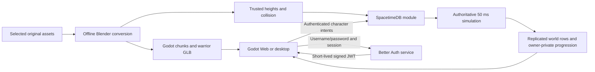

# Architecture

The game uses **standard Godot 4.7.2/GDScript** and a **Rust SpacetimeDB 2.8.3
module**. The database owns identity, presence, positions, terrain height,
collision, attacks, health, respawn, gold and item instances. Clients send intents and render
subscribed state. This is a new game protocol, without compatibility with the
original Metin2 executable.

SpacetimeDB provides transactions, persistence, identity and subscriptions.
Movement, content validation, combat rules and reward ownership are project code.

This page describes the implemented prototype. The
[full-game design](rebuild/architecture-and-delivery.md) separately proposes
module boundaries, state machines, modern replication/privacy contracts and
delivery phases. Its [feature catalog](rebuild/feature-catalog.md) records the
original-source requirements and dependencies; proposed boundaries are not
implemented capabilities.

## Shared map content

The [map pipeline](map-import.md) resolves original source records at pinned
revisions, converts geometry in background Blender, and builds Godot scenes.
`tools/bake_yongan.py` reads the same heights, source attributes, water and
authored model collision. It writes ignored server content plus client collision
metadata. `server/src/content.rs` embeds that data at build time with the
`yongan` feature; reducers never read host files or invoke Blender/Godot.

Water blocks movement only where its surface reaches above at least one terrain
corner, using the same four-corner rule as the rendered water mesh. Water records
wholly buried below dry terrain do not add invisible blocking. Original terrain
blocking attributes and authored model collision remain independent constraints.

Yongan spans 1024 × 1280 meters in map-local positive X/Z coordinates. Source
centimeters `(x,y,z)` become Godot meters `(x,z,-y)/100`. The bake includes a
two-meter terrain grid, one-meter movement attributes, transformed collision
shapes and authored elevated floor triangles. The server uses the terrain
mesh's triangle diagonal for height interpolation and the highest applicable
authored surface for bridges/platforms. This is not general multi-floor
navigation: it cannot choose independently between overlapping traversable
levels at one X/Z coordinate.

Client chunk scenes contain terrain and authored walk-surface colliders for
click picking. Building blocking remains a server rule. Both map identity and
content hash are advertised by `world_info`; native metadata and the browser
manifest must match before entry. The scheduled simulation refreshes this row
from compiled metadata after module publication, preserving characters. The
pinned SpacetimeDB 2.8.3 module has no update lifecycle hook, so the scheduled
refresh handles same-map content updates. Changing map identity requires a new
database or an explicit migration. The separate map-preview remains an inspector
with no multiplayer connection.

Without the Cargo feature, the server uses the small flat training ground with
five box obstacles. Make enables Yongan by default; raw Cargo has no default
feature. Both builds expose the same protocol-5 schema.

## Networking and runtime boundaries

The pinned [native GDScript SDK](https://github.com/flametime/Godot-SpacetimeDB-SDK/tree/f6c59d7068e5dacbde0559906746d0a6c5933ffb)
is vendored in `client/addons/SpacetimeDB`, plugin version **0.3.2**. Tested
compatibility is this exact SDK, Godot 4.7.2 and SpacetimeDB 2.8.3.

The socket subprotocol is `v3.bsatn.spacetimedb`. In the pinned server,
[wire protocol v3](https://github.com/clockworklabs/SpacetimeDB/blob/v2.8.3/crates/client-api-messages/src/websocket/v3.rs)
coalesces messages using the
[v2 binary schema](https://github.com/clockworklabs/SpacetimeDB/blob/v2.8.3/crates/client-api-messages/src/websocket/v2.rs).
This transport version is separate from application
`world_info.protocol_version = 5`, checked before joining.

Decoding runs on the main thread, with no compression and
`confirmed_reads = false`. Cached tables require primary keys; Brotli is
unsupported. Local SDK changes have [separate provenance](../client/addons/SpacetimeDB/UPSTREAM.md).
The standard engine and pure GDScript path support Web without a .NET dependency.

| Location | Responsibility |
| --- | --- |
| `server/src/lib.rs` | Character-keyed player/session tables, reducer validation, scheduled movement, chat |
| `server/src/accounts.rs` | Trusted JWT claims, account roster/selection, connection leases and inventory read filters |
| `auth/` | Better Auth HTTP service, account sessions, signed JWTs, persistent SQLite and signing keys |
| `server/src/movement.rs` | Direction, speed and training-ground sweep/sliding rules |
| `server/src/content.rs` | Trusted terrain, map bounds, building/water blocking and elevated surfaces |
| `server/src/combat.rs` | Monster simulation, attacks, health, death/respawn and loot |
| `server/src/inventory.rs` | Item ownership, grid placement, equipment, consumables and item drops |
| `server/src/progression.rs` | Source-backed Warrior stats, experience quarters, levels and stat allocation |
| `server/src/admin.rs` | Default-deny progression capabilities, private feedback, receipts and audit records |
| `client/scripts/net/game_connection.gd` | Typed account/gameplay facade, SDK lifecycle, version checks and subscription dictionaries |
| `client/scripts/net/account_auth.gd` | Same-origin auth HTTP requests and private remembered-session storage |
| `client/scripts/net/account_flow.gd` | Entry screens, availability, selection, logout and JWT refresh/reconnect |
| `client/scripts/main.gd` | Input, entity instances, loading, camera and HUD |
| `client/scripts/actors/` | Interpolated generated-GLB Warrior/Wild Dog actors, equipment attachment and loot visuals |
| `client/scripts/world/world_stream.gd` | Content manifest, downloaded packs, nearby chunk instances |
| `client/scripts/ui/classic_*.gd` | Original UI art/layout, inventory slots, taskbar, tooltips and minimap presentation |
| `tools/export_playable.py` | Isolated Web/Linux builds and optional test-only probes |
| `deploy/`, `tools/deploy.py` | Isolated Docker services, HTTPS/WSS and deployment |

Gameplay code consumes dictionaries and calls `GameConnection` methods. SDK
resources, generated bindings and authentication tokens stay behind that
boundary. `client/spacetime_bindings/` is generated, not manually maintained.

## Accounts and application contract

Better Auth **1.7.3** handles username/password registration and login, session
validation, password hashing and rate limiting. Its separate Node **24.20.0**
service uses SQLite and persistent signing material under `/data`. Registration
collects an email address, but this milestone sends no verification/recovery
email. Account recovery, social login and an account dashboard are deferred.
See [the auth service contract](../auth/README.md).

RS256 game JWTs contain only issuer, audience, opaque account subject, issue time
and expiry. The production issuer is `https://kcanakdag.com:8443/auth`, audience
`mt2-game`, and lifetime five minutes. The host verifies signatures through the
issuer's discovery/JWKS endpoints; the module separately requires the exact
issuer, audience and unexpired credential when connecting and acting.
`MT2_AUTH_ISSUER` overrides the trusted issuer at compile time for local tests.
Remembered account sessions last up to 30 days. Logout revokes the auth session
and disconnects the client; an already issued JWT remains valid until expiry.

An SDK caller identity identifies the account. `player.identity`, item owners,
loot owners and controllers identify a persistent character. New character IDs
are domain-separated deterministic identities derived from account and slot;
names confer no ownership. `GameConnection.account_identity` and
`local_identity` expose these two different concepts to the client.

| Table | State and visibility |
| --- | --- |
| `account_character` | Character Identity primary key; account, slot, name, empire, `character_class`, sex; owner-only RLS |
| `account_state` | Account Identity primary key; selected-character Identity (ZERO when unset), in-world flag; owner-only RLS |
| `player` | Public character Identity primary key; name, X/Y/Z, heading, activity/online, action and life sequences, health/max health, gold, respawn and current-action timestamps; offline rows also readable |
| `player_appearance` | Presence-only character projection with empire, class, sex and equipped weapon vnum; inserted on entry and removed on leave/expiry/disconnect |
| `monster` | Numeric ID; Wild Dog definition identity/model/motion/action, position, heading, health, activity, action and life sequences, respawn and current-action timestamps |
| `loot` | Numeric ID; position, gold, owner character, reservation and expiry |
| `inventory_access` | Character-to-account mapping; public with a strict account-only read filter |
| `inventory_item` | Numeric ID; owner character, server-assigned account, vnum, count, bag cell, equipped flag; account-owned rows only through RLS |
| `item_drop` | Numeric ID; position, vnum/count, owner character, reservation and expiry |
| `character_progression` | Character Identity primary key; owner account, level/current and next experience, quarter step, unspent points, base stats, random HP/SP growth and SP totals; owner-only RLS |
| `command_feedback` | Bounded account-private command result stream ordered by server ID; owner-only RLS |
| `world_info` | Protocol, map identity/content hash, trusted action profile/hash, tick interval and legacy half-size |
| `simulation_clock` | Public authoritative tick timestamp used to seek late-joined action clips |
| `obstacle`, `chat_message` | Training obstacles and retained normal chat |

The pinned `unstable` RLS feature filters inventory directly with
`inventory_item.account = :sender`. The server assigns this indexed account
field from the character's `inventory_access` record when granting an item;
clients cannot provide or change ownership. The access mapping has its own
strict `account = :sender` filter. An account can read its characters' items,
including inactive characters, but can act only as its selected active
character. This is independent of client-side filtering. Roster and selection
filters also select the authenticated caller's account. The direct filter
avoids a join that the actual 2.8.3 subscription engine rejected even with the
join columns indexed. Two real authenticated accounts exercise the HTTP service,
Godot SDK and SpacetimeDB together, including raw subscribed roster, state,
access-map, inventory and progression privacy, four-slot creation, rejected
foreign actions, switching and reconnect. The retained guest-enabled disposable
world has separate historical inventory evidence. See
[verification evidence](distribution.md#verification-status).

Read privacy covers account-to-character mappings, account state, inventory
access mappings, inventory rows, character progression and command feedback.
Private operator receipts, rate state, capabilities, audits and monster-damage
ledgers are not product subscriptions. The public `player` table has no
server-enforced online-only filter: other authenticated accounts can read offline
character names, positions, health and gold. The client's online-only query
controls presentation, not access. Owner RLS checks account identity alone.
JWT expiry rejects gameplay reducers and removes active presence, but revoking
already-established read subscriptions at expiry or logout has not been
demonstrated. A stale same-account socket may retain reads unless the host
closes it; this is a source-review concern, not a reproduced runtime result.

The lobby subscribes to the private account roster, selection, progression and
command feedback. Those owner subscriptions remain active during world play so
status and command results do not need an overlapping world subscription. World
entry adds online players, monsters, drops, inventory, map information and chat;
leaving unsubscribes that world state. No spatial interest filtering exists yet.
Yongan bounds come from baked content rather than the legacy `half_size` field.

| Reducer | Behavior |
| --- | --- |
| `open_account()` | Validate credentials and acquire one controlling connection per account |
| `create_character(slot, name)` | Enforce four slots (0–3), unique case-insensitive 2–16-character names; create male warrior in empire 1 and once-only starter items |
| `select_character(character_id)` | Require ownership; atomically leave any active character and update selection |
| `enter_selected_character()` | Acquire the selected character controller and enter the world |
| `leave_world()` | Stop movement, remove online presence and return to selection |
| `set_move_input(dx, dz)`, `move_to(x, z)`, `stop_moving()` | Validate finite/ranged movement intents and trusted collision |
| `perform_attack()` | Enforce cooldown, stop movement and damage an eligible nearby enemy |
| `pickup_loot(id)`, `pickup_item_drop(id)` | Validate owner/reservation, range, expiry and capacity; grant rewards atomically |
| `move_item`, `equip_item`, `unequip_item`, `use_item` | Validate the active character's ownership, placement and consumable rules |
| `allocate_stat(character_id, stat_code)` | Require the currently selected in-world character, ownership, live controller and an unspent point; accept only `st`, `ht`, `dx` or `iq` |
| `request_command_help(request_id)` | Return bounded owner-private help without writing synthetic public chat |
| `admin_grant_progression_xp(request_id, amount_text)`, `admin_raise_progression_level(request_id, target_text)` | Require a fixed server-side capability and active selected character; validate bounded decimal text, rate limits and replay-safe request identity before applying the normal progression kernel |
| `send_chat(message)` | Validate 1–160 printable characters, one message per second, retain latest 100 |

Private `session` and `account_control` tables bind authenticated accounts to
sockets. Character-keyed controllers retain attack/chat deadlines across
switching and reconnect. A second socket cannot control the same account or
evict its current character on disconnect. Expired account leases stop active
presence. Scheduled simulation accepts only the database scheduler's identity;
movement, attacks and pickups reject dead characters.

Public account builds reject guest credentials. `enter_world(name)` remains
only for disposable legacy tests with compile-time `MT2_ALLOW_GUESTS=1`.
The current public P1 development route uses `mt2-p1-v4`; the preceding
`mt2-accounts-v3` account database and old `mt2-yongan-v2` guest database remain
stored without exposing their gameplay routes. No guest claim or migration API
is implemented. Protocol 5 progression development uses a new database until a
deliberate migration and compatible public client are ready. Deployment
preserves existing data.

## Movement and combat

The server ticks every **50 ms**, caps movement integration at **100 ms**, and
limits speed to **5 m/s** with normalized diagonals. Held input expires after
600 ms; clients refresh it every 100 ms. A 0.45 m character radius contributes
to collision checks. Yongan travel is split into small steps with axis sliding,
height-change limits and terrain/model blocking. Destinations do not determine
the player's Y; the server computes it.

Click movement is a straight destination vector, not a pathfinder. There is no
local position prediction, reconciliation system, player-to-player collision
or general layered navigation. Local and remote visuals interpolate toward
replicated three-dimensional positions.

The selected fixture is original Wild Dog vnum 101 with trusted actor, model,
motion-set and action IDs. A player hit deals 25 base damage plus 10 for the
equipped starter sword, within 2.7 m and a 2 m height difference, with a clear
path and an 850 ms cooldown. The Wild Dog has 100 health, chases eligible nearby
players around its home, and deals 20 damage within 1.9 m every 1.3 seconds.
Those balance values are explicit prototype overrides rather than a claim of
full original-game balance.

The build requires the generated, ignored
`server/content/p0-warrior-dog/actions.v1.json`, verifies its canonical SHA-256
definition hash and emits typed Rust constants. Player and dog hits resolve only
inside the selected source-derived microsecond window. Target life generations,
window expiry and consumed pending state prevent delayed actions from hitting a
new respawn or applying twice. Equipment and damage are frozen when the server
accepts the action. The 850 ms player cooldown intentionally allows another
accepted action to replace the current one before its nominal 1 s clip ends.

Each simulation tick collects due player and monster hits into one global queue
and orders them by the authoritative source hit timestamp before applying
movement or monster AI. An exact timestamp tie resolves player hits before
monster hits, then uses player identity or monster ID as a stable tie key. Before
consuming a queued hit, the server reads the source's current pending action,
life generation and controller state again. An earlier death, leave, respawn or
replacement action therefore cancels a later copied event, while valid events
retain their expiry and exactly-once consumption rules.

The P1 compiler produces a client presentation manifest and a separate trusted
server action artifact from the same selected profile. The manifest identifies
Warrior race 0, Sword+0 vnum 10 and Wild Dog 101, with its gameplay-definition
hash checked against the server artifact before an export. Public
`player_appearance` projects only appearance fields needed by peers; it does
not expose private inventory rows. `simulation_clock` lets a late-joining
client seek an already accepted action without turning its local animation into
authority. See [P1 actor content import](content-import.md) for the compiler
and package boundary.

A defeated Wild Dog respawns after 12 seconds and drops five gold plus one red
potion. Gold and item drops have separate authoritative rows. Both remain
reserved for the slayer for 10 seconds, expire after 60 seconds, and require
a pickup within 2.5 m with compatible height and clear path. An atomic reducer
deletes the loot and credits the player, preventing duplicate grants. A dead
player respawns after 8 seconds at the town spawn with full health and retained
gold. Reconnecting does not bypass death or attack deadlines.

## Character progression and operator controls

The bounded P2 progression slice implements catalog item `SRV-007` for the one
currently supported male Warrior. The generated trusted definition contains the
original level table through compiled level 120, the normal monster/player level
delta percentages and the Warrior's initial constants. Runtime progression is
capped at level 99. At the cap, `experience`, `next_exp` and `level_step` are all
zero, which gives clients a defined cap state without shipping the experience
table. A new Warrior starts at level 1 with ST 6, HT 4, DX 3, IQ 3, 760 maximum
HP and 260 maximum SP.

The server computes quarter thresholds using the source's single-precision
operation: `q = (next_exp as f32 / 4.0) as u32`, followed by `q`, `2q`, `3q`
and the exact level requirement. Each crossed positive step refills HP and SP if
the character is alive and attempts to deliver two automatic potions. Resulting
levels through 10 use small red potions (`vnum=27001`); later levels use medium
red potions (`vnum=27002`). Grants fill existing stacks, then free bag cells,
then create an owner-reserved ground drop that expires after 300 seconds. Only
items actually stacked, inserted or dropped count as delivered. Consumption of
the medium potion remains outside this slice.

The first three quarters grant one stat point while the pre-level is below 91.
The fourth rolls and stores 36–44 HP and 18–22 SP growth, advances the level and
also performs the common refill/potion effect. `allocate_stat` consumes one point
and caps each stat at 90. Vitality and intelligence immediately update maximum
HP/SP but do not heal the current resource as a side effect of manual allocation.

Monster experience uses a private per-monster-life damage ledger. Registered
damage includes overkill rather than only the target's remaining health. At
death, a contributor must still be online on the same connection that registered
the damage and within the source approximate-distance limit of 5,000 cm; being
dead does not itself remove eligibility. Reconnecting invalidates credit tied to
the old connection. For a non-party kill, 20% of the level-adjusted reward goes
to the highest contributor and 80% is split by damage proportion using the
source's single-precision truncation. Stable character Identity order replaces
the original process-local VID for deterministic ties. Party grouping is deferred.
The current Wild Dog level 1 reward is 15 experience; its attack/damage values
remain the explicit prototype balance described above.

Operator commands use dedicated typed reducers and never pass through public
chat. `/help` is available to an authenticated controlled account. `/xp` and
`/level` require an active account capability and an active selected character
controlled by that connection. Exact compile-time bootstrap identities can seed
the first capabilities; an authorized capability holder can then provision or
revoke persisted operator capabilities through the audited typed reducer.
Production/default builds provision no identities. Bounded private feedback,
rate checks, receipts and audits make a replay with the same actor, action and
normalized arguments return
the recorded outcome without another mutation. The receipt retains the original
target, so changing character selection before that replay does not redirect the
grant. Reusing the request ID with a different action or normalized argument is
rejected. Combat experience clamps at remaining cap capacity,
while an operator's exact requested amount is rejected if it cannot be applied
in full. `/level` only raises a character by applying the normal experience
steps; lowering remains a separate reset/migration concern. See
[development and admin automation](rebuild/development-and-admin.md).

The accepted local training report
`.local/p2/accounts-progression-20260907T0349.json` contains 298 passing checks.
It covers an exact +15 solo reward, separate 70/35 to 11/4 and 75/35 to 11/3
registered-damage lives, owner privacy, disconnect/reconnect invalidation, all
20 level-1 Wild Dog kills, the three quarter states, level 2, automatic potions,
bounded growth and VIT allocation without healing current HP. The accepted
199-check exported Chrome/Linux run in
`.local/p2/browser-positive-progression-fresh-read/report.json` covers five
ordinary kills and 20 actual Space attacks, exact +15 rewards, the first
75-EXP/+2-potion quarter and source orb, a real VIT click changing 740/760 to
740/800 without healing, private ownership, lifecycle persistence, both real
four-minute refresh timers, and clean browser/native engine results. Privileged
operator success and an explicit
selection-change replay assertion also remain pending with the unpublished local
bootstrap fixture. Protocol 5 has not replaced the public P1 route.

## Inventory and original UI

Inventory retains character-keyed `Player`, `Monster` and `Loot` state and adds
a server-assigned account field to item rows under application protocol 5.
Clients require the account tables, reducers and regenerated bindings. Publish
the matching module before running the client; older schemas cannot satisfy
its subscriptions. This milestone creates a separate public account database;
guest inventories remain in the retained old database and are not migrated.

`inventory_state` marks once-only initialization and stores potion cooldowns.
Each newly created character receives one sword (`vnum=10`) and five red potions
(`vnum=27001`). Switching, entering and reconnecting never grants another set.

The bag has 90 cells in two 45-cell pages, each five columns by nine rows.
Items occupy one column: the sword is two cells tall and a potion one. A sword
cannot wrap across a page boundary; the server checks every occupied cell.
Potions stack to 200, swords to one. The equipment slot uses cell 255 as a
server sentinel; its original artwork is 32 × 96 pixels, while the sword's
32 × 64 icon still occupies only two bag cells. Equipping grants the server
damage bonus without yet adding a 3D sword attachment to the warrior.

A red potion heals up to 40 HP with a one-second cooldown. Full-health use,
dead-player use, wrong ownership and unsupported item types fail without
consumption. Item pickups respect the same 10-second reservation, 60-second
expiry, 2.5 m reach and compatible height/clear-path rules as the gold loop.
Stack filling and new-cell allocation occur in the same reducer transaction as
drop deletion, so a full bag cannot partially consume a reward. Inventory,
equipment and cooldown state survive death/reconnect; there is no player-driven
item deletion, trading or arbitrary item/currency grant endpoint.

The UI uses selected original raster artwork converted by
`tools/import_metin_ui.py`: 224 UI images and one Yongan map assembled from 20
original minimap tiles, producing 225 images from 293 pinned source files.
Source resolution and alpha are preserved. Layout
references guide the 176 × 565 inventory, 37-pixel taskbar, eight visible
quickslots and minimap. See [UI assets](ui-assets.md) for provenance and limits.

Mouse carry/drag sends normal item reducers; slots redraw from subscribed state
after acceptance. `I` opens inventory, right click equips/uses, `1–4` and
`F1–F4` activate quickslots, and `Ctrl+F3` opens developer inspection. Quickslot
bindings, selected pages and inventory-window position are local UI preferences
scoped to the character profile; they confer no item ownership or permission.

Original UI fidelity is a target. Entry screens use selected original art and
a 3D warrior preview; additional classes/empires, skills and social controls
remain inactive. The preview uses the existing wait animation rather than a
complete original intro motion set. Font rendering and complete behavior have
not been compared with a running original client. `C` and the character button
open the status panel for the subscribed owner row and normal stat allocation.
The inventory and status panel introduce bounded equipment and progression
loops, not complete original equipment, skill or class progression systems.

## Original map and chat panels

`classic_map_panel.gd` separates the small minimap from the original atlas.
The minimap uses the 1024 × 1280 stitched tiles, original player/other-player
marker art and subscribed positions; close/reopen and zoom are interactive.
`M` or the minimap atlas button opens the separate original 171 × 214 atlas
inside a 186 × 252 draggable window. M, Escape and its close button dismiss it.
The atlas shows the local player; it does not invent absent NPC/warp data.
Unsupported maps disable the atlas and zoom controls.

`classic_chat.gd` places a 600-pixel ordinary chat entry at the horizontal center,
62 pixels above the viewport bottom. Passive messages fade after five seconds
or once they are older than the four newest, with a time-based decay. Enter
opens entry; submitting nonempty text sends a normal server intent, clears the
field, releases both chat inputs and closes ordinary entry. Empty Enter also
closes ordinary entry. Up/Down recalls locally sent text, and Escape cancels it.
World left/right clicks release chat focus before movement or camera handling.
The submission event is consumed before focus changes so the root Enter
shortcut cannot reopen chat. Typing still owns input while active, preventing
I/M/L and movement keys from also triggering game controls. Returning to
movement after sending is the requested usability behavior; it deliberately
differs from the original source's keep-editing behavior.

`L` or the chat-history button opens a draggable, resizable log with original
title and scrollbar parts. The client presents subscribed chat messages;
the server still accepts only normal chat, limits messages to 160 characters,
rate-limits submission and retains 100 rows. An original 300-line reference
does not imply server-side 300-line persistence or implemented party/guild/
whisper/shout channels. Unavailable channel controls stay inactive.

The UI asset manifest includes decoded RGBA hashes. Import settings prevent
lossy compression, mipmaps and alpha-border modification, and exported-PCK
audits compare every UI texture's loaded pixels to those hashes. This checks
texture preservation, not full original font/layout behavior. The source's
Tahoma GDI sizes are documented; no font has been added or redistributed.

## Loading and identity lifecycle

Account connection advances through `connecting`, lobby subscription, `opening`
and `lobby`. Selected entry advances through world `subscribing`, optional
`loading`, `joining` and `connected`; `leaving` returns to the lobby. Content is prepared after world metadata arrives
and before the normal join reducer. Failures clear stale snapshots; reconnect
constructs a fresh SDK instance/cache. If map identity/content changes while
loading, joining or connected, the client disconnects with a refresh/restart
notice. It does not keep playing against different collision data.

Web exports use a core PCK plus a shared scenery pack and 20 section packs.
The manifest and SHA-256 filenames tie downloads to their content; the loader
checks hashes before mounting packs without replacement of mounted resources.
The pack generator includes feature-specific imported texture dependencies as
well as default resource remaps. Numeric terrain tile/attribute textures use
lossless import without mipmaps or GPU compression, preserving each ID/bit.
Every section is audited in a fresh Godot process with only its shared and
section packs; the audit compares exported numeric texels against the source
PNGs and checks shader, layered textures and textured prop dependencies.

The loader refuses to combine a new scenery manifest with already mounted
packs. A refresh/restart loads a coherent set after an update. Browser HTTP
responses are validated after browser decompression, then saved and closed
before cache-file hashing and mounting.
Nearby sections are requested around the player and distant scene instances
are released. Downloaded files may remain cached; unloading a scene is not a
promise that every engine resource or mounted pack has left memory. Initial
engine/core/shared/start-area loading still exists. Background section loading
and browser reconnect are verified. The corrected public browser build also
passed rendered terrain and keyboard combat checks. See
[distribution](distribution.md#verification-status).

Browser game JWTs use the SDK's WebSocket query-token path because browsers
cannot set arbitrary handshake headers. HTTPS/WSS and disabled URL logging keep
them out of proxy access logs; native clients use authorization headers.
Remembered bearer sessions live under `user://accounts/`, scoped by auth origin
and local profile, with owner-only permissions where supported. Game JWTs are
kept in memory. Submitting login/registration immediately clears password fields. Logout
clears the remembered session and any remaining form password.
Snapshots, logs and exports must exclude passwords, bearer sessions and JWTs.
Clearing browser site data loses the remembered login, not the server account
or its character data; signing in again recovers the roster.

The coordinator requests a new JWT after four minutes, closes the current SDK
connection, and reopens the same account. If it was in the world it re-enters
the selected character after authenticated lobby state arrives. This refresh
path includes a brief reconnect rather than continuous socket renewal. The
server/channel board polls `/auth/health` and the selected database's exact
`/v1/database/<name>/identity` route every 15 seconds; availability comes from
responses rather than a hardcoded Online label.

## Protocol changes and evidence

Publish a compatible module to the intended database, regenerate `make bindings`,
then update the wrapper, client and live smoke tests together. Use a new database
or deliberate migration for incompatible changes. The generator fetches
`/v1/database/…/schema?version=10` and records the schema/SDK/generated-file hashes.
`--offline` uses the saved schema. Increase the application version when the
contract becomes incompatible.

Historical protocol-2 evidence follows. The Yongan baseline had 16 Rust tests, 22 live SDK multiplayer checks
and 19 combat checks in `.local/yongan-network-final.json` and
`.local/yongan-combat-final.json`. Real exported Web/Linux tests cover both the
training ground and Yongan. Yongan's 26-check real-GPU browser run covers mutual
rendered movement, background sections, keyboard movement/attacks/loot, monster
and player death/respawn, rejection, reconnect/refresh and identity/position
preservation across database-container replacement, with no engine errors.
The report and screenshots are in `.local/browser-proof/20260906-161458/`.
All 20 section packs also pass isolated resource loading and exact numeric
texture-byte audits. Separate normal Web/Linux release checks confirm direct
browser UI/keyboard movement, correct textures, mutual presence and absent test
hooks; evidence is in `.local/release-browser/` and `.local/release-native/`.
The inventory extension has 20 passing Yongan Rust tests (14 in training), four
UI conversion tests, a repeated 22-check movement smoke in
`.local/inventory-movement-smoke.json`, and 56 live inventory checks in
`.local/inventory-smoke.json`. Those include ownership/grid rejection, equipment
damage, potions, item-drop reservation/stacking, and death/reconnect persistence.
Publishing additively to an existing test world preserved all four player rows
exactly, including identity, position, health and gold; the before/after evidence
is `.local/inventory-migration-before.txt` and `inventory-migration-after.txt`.
Native MCP inspection confirms I opens inventory and right click equips the
sword through the server. The first original-HUD release then passed 39 public
Chrome/Linux checks in `.local/browser-proof/20260906-165921/report.json`, including
inventory input, quickslots, refresh, combat and item pickup. That published
development build intentionally retained the user-authorized fixed test probe.
The area-map/chat pass has 15 UI, 17 map and 22 chat native component checks.
Its real Chrome/Linux loopback run passed 45 checks in
`.local/browser-proof/20260906-174144/report.json`, with no browser engine errors.
The run covers map/chat dragging and resizing, bottom-center chat, delivery to
the other subscription, and WASD after send, Escape, world click and chat-history
submission, plus rejection and reconnect/refresh/disconnect behavior. The runner
waits for stopped subscribed state and visual interpolation before comparing
reconnected positions. Those Web/Linux test PCKs verified all 160 UI/map images
against exact RGBA hashes; their file inventories contain 582/1,385 entries.
Public release `20260906T154235134255Z` then passed 45 core/panel/inventory
checks in `.local/browser-proof/20260906-174806/report.json`, with no browser
engine errors. Its served manifest equals the exported Web manifest. Public
checks exercise chat open/cancel and panel controls; actual message delivery and
post-send WASD remain the separately verified loopback paths. Native editor
inspection of the connected public game also confirms bottom-center entry and
Escape leaving chat unfocused and hidden.
These checks do not establish full-game fidelity, a large
player-count target or native Windows execution.
See [distribution](distribution.md#verification-status) for current export
evidence and remaining limits.

The account implementation passes 22 Yongan Rust tests, 16 training tests,
Clippy and 58 real HTTP → Godot → SpacetimeDB account checks. The native intro
and main-UI suites pass 27 and 19 checks respectively. Both test exports verify
all 197 UI/map images against decoded source pixels. Native editor entry and
return to selection have been observed. Public account release
`20260906T173802450337Z` passes deployment and HTTPS checks. Local and public
Chrome/Linux runs each pass 103 checks, including real four-minute token
renewal with unchanged identities/positions and no browser engine errors.
