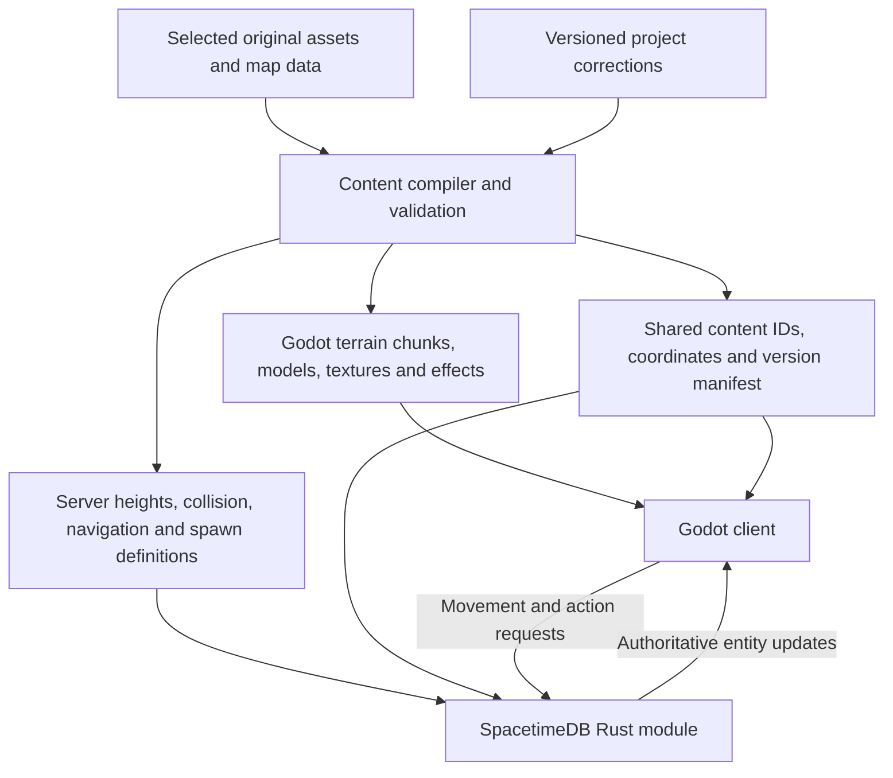

# Client, world, and server rebuild plan

This roadmap extends the current Yongan prototype toward a complete game. The
original-map importer and shared collision bake exist, as does one PvE loop with
damage, death/respawn and gold loot. Browser multiplayer passed on the training
ground and Yongan, including section loading, keyboard combat and reconnect.
The corrected terrain and collision pipeline is verified in the public browser.
An original UI/inventory slice is now implemented: selected original taskbar and
inventory art, a two-page bag, one equipable sword, red potions, item drops and
an original-image minimap. Its Web/Linux exports passed 39 public checks,
including inventory mouse interactions, quickslots, persistence and potion drops.
The following panel pass adds working minimap close/reopen, the separate original
Yongan atlas, centered fading chat and a movable/resizable chat log. It has local
component checks and 45 passing loopback Chrome/Linux checks, including restored
movement after chat. The deployed panel update also passes 45 public core/panel/
inventory checks; actual chat sends remain tested on the separate loopback world.
Complete client interfaces, skills, quests and progression remain future work.
The implemented contract is in [architecture.md](architecture.md).

Assume a faithful classic Metin2 baseline first. Before importing substantial
content, choose the target release and list its classes, maps, items, skills,
quests, and expected behavior. Keep later expansions as additional milestones.
The converter has been exercised on the warrior fixture and Yongan's 20 terrain
sections and 119 static models. Trees and effects remain unsupported; the
procedural Stone Sentinel is not proof of an original monster importer.

## One content source, two map outputs

Build a repeatable content compiler that consumes selected original assets and
metadata, plus explicit project corrections. Produce client and server artifacts
from the same coordinates and stable identifiers.

| Content | Client representation | Server representation |
| --- | --- | --- |
| Terrain | Chunked mesh, material layers, water and presentation | Height samples, walkable areas, boundaries and region flags |
| Buildings and props | Reusable scenes placed by source transforms | Simplified blockers and interaction anchors where relevant |
| Monsters and NPCs | Models, animation sets, sounds and effects | Definitions, spawn regions, AI state, health and action rules |
| Equipment and skills | Models, icons, tooltips and effects | Item/skill definitions, ownership, stats and validation |
| Portals and dungeons | Visible entrance and loading presentation | Destination, access checks and instance membership |

Static visual assets ship in the client package. Live subscriptions carry
changing game state. A tree mesh does not need to be transmitted each time a
player joins. Destructible or interactive objects gain authoritative state and
refer back to their static visual definitions.

Each build records source hashes, converter version, content IDs, map dimensions,
coordinate transforms and content version. The client checks compatibility
before entering a map. This catches accidental content mismatches; server-side
validation remains necessary even when a client reports a matching version.

## Prove one original map

Start with one original starting-area map, then a small representative section
of it containing a road, a slope, a building and an obstacle. The exact source
files and required formats must be inventoried before promising full conversion.

The [archive inspection](original-map-data.md) and [map importer](map-import.md)
cover terrain, placements, property/model references and source format rules for
`metin2_map_a1`. All 601 building/prop placements convert; 368 tree and 6 effect
placements remain unsupported. These steps are still the acceptance framework
for expanding coverage and verifying fidelity.

1. Inspect terrain heights, texture layers, object placement records, collision
   or attribute data, spawn metadata, and dependencies. Record missing files and
   unsupported formats explicitly.
2. Establish source units, axes, origin, object pivots and height interpretation.
   Validate known landmarks and distances against the selected reference.
3. Generate terrain chunks and placed object instances in Godot. Extend the
   existing Blender adapter for meshes and animations as fixtures require it.
   Recreate engine-specific materials and effects where conversion cannot
   preserve them. Blender is a conversion/inspection tool; map placement should
   be reproducible from data.
4. Generate server collision and navigation data from the same normalized map.
   Visual chunk size, simulation cells and network interest areas can have
   different dimensions while sharing a coordinate system.
5. Display server collision, walkability, portals and spawn regions as Godot
   debug overlays. Test both players against walls, slopes, corners, seams and
   invalid destinations before expanding the imported area.
6. Verify a second map and a round trip through a portal before importing the
   remaining catalog. This tests that the converter and world logic generalize.

Godot supports scene import through glTF/GLB and import customization; our
specific legacy conversions still need fixtures and visual checks. See
[Godot scene import](https://docs.godotengine.org/en/stable/classes/class_resourceimporterscene.html).
Track inherited/project scene changes separately from regenerated assets.

## Movement and navigation across both runtimes

The server uses a compact height/attribute grid, authored collision shapes and
elevated walk triangles. Add bounded Rust path searches before promising click
navigation around buildings. Validate clearance, slopes, corners and dynamic
blockers. Current height selection chooses the highest surface; independent
travel through overlapping floors needs a layered representation or graph.

The server computes or validates traversable movement and owns the resulting
position. The client renders that position and can later predict local motion
using matching collision data, with sequence acknowledgements and correction.
Movement and hit timing must be tested under delay and disconnects.

Godot's NavigationServer is an engine subsystem, and its navigation meshes
describe traversable space independently of rendering and physics. It does not
automatically supply pathfinding inside a Rust SpacetimeDB module. See
[Godot navigation meshes](https://docs.godotengine.org/en/stable/tutorials/navigation/navigation_using_navigationmeshes.html).

SpacetimeDB reducers cannot read map files from the host filesystem or invoke
Godot. The Yongan feature embeds trusted baked bytes at build time. If dynamic
content installation is needed, use indexed private tables seeded by module
initialization or owner-authorized imports. Benchmark storage, module size and
access costs before expanding to more maps.
Do not rely on persistent process globals between reducer calls. These choices
follow [reducer execution constraints](https://spacetimedb.com/docs/functions/reducers/).

## Build the complete client as connected features

Keep the existing GameConnection boundary. Add focused scene/controllers as
features grow, so the current main scene and HUD do not absorb every system.

The current classic UI work uses the original selected raster fixture and layout
observations, with new Godot controls and server-backed item operations. Original
fidelity is the target rather than a claim of indistinguishability: login remains
a prototype; unsupported character, skill and social systems are inactive; font
and complete behavior parity are unverified against a running original client.
The equipped sword currently changes damage and its inventory display, without
a 3D attachment. Keep these limits separate from a passing UI asset conversion.

| Client area | Server feature delivered with it |
| --- | --- |
| Login, character selection and creation | Accounts, persistent character IDs, ownership and session control |
| World loading and map transitions | Map/instance membership, content version and validated entry position |
| Targeting, combat feedback and skill bar | Target validation, damage, cooldowns, statuses, death and respawn |
| Inventory, equipment and item tooltips | Item instances, slots, stat calculation and atomic validated operations |
| NPC interaction, shops and quests | Interaction distance, dialogue conditions, prices, quest state and rewards |
| Party, trading, guild and social screens | Membership, invitations, atomic exchanges and permissions |
| Minimap, settings, audio and accessibility | Relevant public map/entity data and saved client preferences |

Use definition IDs to connect presentation to gameplay: an equipped item ID
selects a visual model in the client while the server calculates its effects.
Damage is decided by the server; the client uses authoritative results and
action sequences to show animations, sounds, effects and numbers. Create a
documented policy for permissible latency compensation and animation timing.

Retain the debug panel and extend it with map/content version, chunk boundaries,
navigation, entity counts, simulation time, subscription size and corrections.
Inspect real scenes and screenshots through MCP as each visible feature lands.
The developer bridges remain excluded from friend builds.

## Server organization and world growth

Keep the current single database for the first small world. Introduce stable
character/entity IDs and explicit map/instance IDs before adding more maps.
Split Rust code into movement, world, combat, inventory, progression and session
modules as those responsibilities appear.

Subscribe clients to the map and nearby entities they need. Enforce access to
private inventories, quest state and hidden entities on the server; voluntary
client query filtering alone is not authorization. Measure subscription updates,
decode cost and bandwidth with the pinned native Godot SDK. SpacetimeDB provides
filtered live row replication, but we design the scope and benchmark it:
[subscriptions](https://spacetimedb.com/docs/clients/subscriptions/).

Separate client chunk loading from authoritative map transfers. For a portal,
the server checks access and destination, commits membership and a valid spawn,
and keeps the character noninteractive while the client loads compatible
content and applies destination subscriptions. Timeout/reconnect handling must
leave exactly one character in one valid location.

Schedule work for active simulation areas and avoid updating idle world state
unnecessarily. Test a declared player/entity population and hardware target
before choosing database partitioning. Multiple database instances would add
character transfer and cross-instance party/trade coordination; use measured
requirements to justify that architecture.

## Milestones and completion evidence

Each milestone includes client, server, content and two-client verification.
Update bindings with every schema change and use disposable test databases.

| Milestone | Deliverable | Evidence required |
| --- | --- | --- |
| 1. Scope and representative map section | Fixed reference release, content manifest, one converted area and matching server geometry | Landmark/scale comparison, both clients see each other move, server rejects travel through blockers |
| 2. Complete starter map | Chunk loading, navigation, interaction locations and map diagnostics | No visible chunk gaps or collision disagreement; measured loading, memory and frame times |
| 3. Persistent playable loop | Character ownership, one class, a few enemies, combat, loot, inventory/equipment and leveling | Both players fight and receive valid rewards; duplicate actions cannot duplicate items; reconnect/server restart retains progress |
| 4. Complete starter experience | NPC shop, quest, skills, death/respawn, minimap and useful settings | Both players complete the same defined progression route and use all relevant UI |
| 5. Second map and instances | Portal transition, destination loading and membership handling | Two players transfer and return; interrupted loading/reconnect leaves valid presence and position |
| 6. Broader classic content | Remaining selected classes, items, enemies, quests, maps and social systems | Feature checklist and comparisons against the chosen reference; representative fixtures for each new asset category |
| 7. Release operation | Stable hosting, client updates, version compatibility, administration, backups and recovery | Declared load target met, recovery exercised, exported clients tested on the intended network/platform |

Do a basic load probe before broad content expansion and repeat it when new
systems materially change cost. The operational milestone formalizes the
release target rather than postponing all performance work until the end.

The implementation covers parts of milestones 1–3 and a development deployment
from milestone 7: Yongan import/bake, one warrior, authoritative movement, one
procedural enemy, damage/death/respawn and a gold reward. That subset does not
complete any broad milestone merely because SDK tests pass. Public browser/Linux
multiplayer, combat and normal-release checks pass for the preceding Yongan
slice. The inventory/equipment slice is implemented and verified: once-only
sword/potions, bounded bag cells/stacks, server equipment
bonus, healing, item drops and original UI controls. Its 56 live inventory checks
and additive data-preservation check pass, as do 39 public browser/Linux checks
for the original HUD and inventory. The added map/chat panels now pass native,
loopback and public browser checks with exact-pixel export audits. Account and
character entry now takes priority over extending equipment and progression.

## Immediate next milestone: account to world

Build the beginning of the player experience before expanding combat content.
This is planned work, not a description of the existing guest connection panel.
Match the selected original client's screen layout and flow while connecting
each screen to real server state.

1. Separate authenticated accounts, persistent characters and active sessions.
   The server owns character slots, names, ownership and character selection.
   Account details and character inventories require server-enforced read
   privacy; filtering a public table in the UI does not provide it.
2. Keep auth small: basic account creation, username/password login, a remembered
   session and logout. Defer account recovery, a full account dashboard and
   social sign-in. Use an established authentication implementation; the initial
   candidate is Better Auth with its username plugin and documented SpacetimeDB
   integration. Pin and verify the integration against SpacetimeDB 2.8.3 and
   both Godot clients before adopting it. Keep credentials out of gameplay
   tables and logs; small scope still requires ownership and session validation.
3. Rebuild the original server/channel selection and login screens using
   selected pinned assets. Initially advertise the one actual development
   server/channel and its real availability. Additional entries require real
   destinations and an account ownership contract across them.
4. Add character selection and creation, including a 3D preview, validated
   names and persistent slots. Follow the reference empire-selection flow;
   initially enable the warrior and the empire/map combination supported by
   Yongan. Enable more classes and starting locations when their content works.
5. Enter the world only after the server accepts the selected character.
   Introduce a lobby state before world subscriptions and map streaming, then
   support returning to selection, switching characters and logging out.
   Gameplay reducers resolve the active character through its authorized
   session; a supplied character ID is never sufficient proof of ownership.

Use original intro backgrounds, frames, button states, empire imagery and
character presentation. The pinned archive inventory includes English
`loginwindow.py`, `selectempirewindow.py`, `selectcharacterwindow.py` and
`createcharacterwindow.py`, their `intro*.py` behavior references, and intro
image descriptors. Resolve each screen's actual dependencies through the
existing selected-asset converter, preserve provenance, and verify native and
exported pixels. This inventory check does not mean these screens or all their
assets have already been imported. Keep unsupported class/map choices inactive.

Authentication references checked for this plan:
[Better Auth username sign-in](https://better-auth.com/docs/plugins/username)
and [SpacetimeDB integration](https://spacetimedb.com/docs/core-concepts/authentication/BetterAuth/).
The username plugin's standard registration also requires an email address;
account creation can collect it while the familiar login remains username/password.
These are implementation candidates, not newly installed dependencies or a
verified authentication deployment.

Migrate existing guest characters and their items without wiping development
data. Preserve positions, health, gold, equipment, starter-grant markers and
cooldowns. Linking an existing guest character to an account must prove control
of that guest identity; matching its display name is insufficient. Record a
repeatable migration and ensure retrying it cannot grant another starter set.

Completion evidence: two independent accounts can create/select characters,
enter the same world, see each other and move. Logging into the same account
from a fresh browser profile or another client restores its character roster
and selected character's items and position. Switching characters, logout,
reconnect and duplicate sessions preserve valid ownership and presence. Tests
must reject another account's character or inventory access, enforce name/slot
rules, and verify existing guest data survives migration. Inspect the actual
native and exported browser screens, including keyboard focus and loading.

After this flow is complete, resume visible equipment, original enemies,
combat feedback and leveling, followed by shops and starter quests.

The full original map set, remaining classes and complete gameplay are not
imported or verified. Docker hosting on port 8443 is a development deployment;
load targets, recovery drills and broader platform verification remain work.
Evidence is tracked in [distribution](distribution.md#verification-status).
