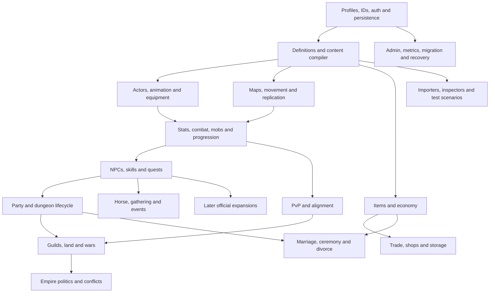

# Full Metin2 rebuild plan

The goal is a complete Metin2 experience with a standard Godot client and a
SpacetimeDB server: preserve classic movement, combat rhythm, characters,
world, progression, economy, social systems and recognizable UI, while
modernizing architecture, performance, development automation and operations.
Marriage, weddings and divorce are required planned systems, alongside the
less visible quest, guild, event, content and administration work.

This source-backed plan supersedes the earlier seven-row prototype roadmap.
It describes the whole rebuild, not just the next starter-town milestone.
It was assembled on 2026-09-06 from original client/server source, two independent
emulators, published feature references, and this repository's actual code and
recorded test evidence. Source research used three Sol subagents in parallel.
No original game code was executed or imported into the runtime, and the live
game was not changed by the planning work.

## Read the plan

| Guide | Purpose |
| --- | --- |
| [Feature and dependency catalog](rebuild/feature-catalog.md) | Every audited server/client requirement, reference comparison and modernization task, with stable IDs, scope, status, prerequisites and evidence |
| [Architecture and delivery](rebuild/architecture-and-delivery.md) | System boundaries, state-machine contracts, dependency order, phases, integration gates and work-package template |
| [Development, automation and admin tools](rebuild/development-and-admin.md) | Reusable content compiler, batch animation/equipment/map/quest pipelines, inspectors, simulators, performance lab and operator controls |
| [Original server audit](rebuild/server-audit.md) | C++ gameplay, commands, quest APIs/scripts, data catalogs, marriage, guilds, politics, events and conditional systems |
| [Original client audit](rebuild/client-audit.md) | C++/Python UI, motion/asset/content formats, feature switches, another client source and presentation coverage |
| [Emulator and later-feature audit](rebuild/reference-audit.md) | open-mt2 and Quantum Core X implementation evidence, omissions, tooling lessons and later official/fork-specific systems |
| [Current implementation](rebuild/current-state.md) | What our prototype actually implements, recorded two-client evidence and concrete gaps |
| [Coverage and decisions](rebuild/coverage-and-decisions.md) | Server/client map crosswalk, missing references and concrete decisions with exit conditions |
| [Machine-readable plan](rebuild/plan.json) | Canonical system/feature IDs, acyclic implementation prerequisites, behavior coupling, source pins and coverage links |
| [Planning validation](rebuild/validation.md) | Requirement coverage, source-review checks, catalog validation and the limits of this planning pass |

The feature catalog is generated and validated with:

```sh
python3 tools/check_rebuild_plan.py
# After editing docs/rebuild/plan.json:
python3 tools/check_rebuild_plan.py --write
```

These commands only inspect/generate planning documents. Future content/admin
command names in the tooling guide are proposals, not existing executable tools.

## Scope and completeness rules

Use a classic four-class experience as the first delivery profile: Warrior,
Ninja, Sura and Shaman, their supported sex/appearance variants and skill
schools, all three empires, the selected classic world/progression/economy,
parties/PvP/guilds, horse/gathering, quests/dungeons, marriage and live events.
Later official systems remain individually visible in the expansion ledger;
private-server conveniences and disabled source experiments are separate
policy decisions. This ordering does not remove them from the overall plan.

There is no single source tree containing every feature from every Metin2
release, region and private server. The honest completeness target is:
**account for every discovered feature family and every selected content record
in the pinned reference profile, and expose all missing or ambiguous evidence.**
A directory, packet, enum or README checkbox is not a working feature. A
historical archive plus a modern wiki is not a matched retail release.

Before balancing or bulk importing content, record a versioned profile with
exact client/server/data pins, enabled systems, formula/level caps, active quest
list, map/item/mob/skill catalogs, locale, intended visual references and
intentional differences. Cross-check IDs and shared definitions between sources.
The currently inspected server and client revisions are evidence snapshots;
their compatibility as one complete original-client release is not yet proven.
A running original-client reference capture and provenance are needed to claim
indistinguishable presentation and behavior.

Every selected content row must eventually be classified as imported and
verified, awaiting a supported converter, missing a dependency, intentionally
excluded with a profile reason, or an explicitly authored replacement. Do not
hide unsupported trees/effects, inactive quests or missing server tables behind
an aggregate “map imported” or “quest system complete” label.

## Source and coverage discipline

The detailed audits record immutable source paths/symbols and their retrieval
limits. Tracked evidence inventories contain metadata and registry names, not
third-party implementation bodies or original asset archives:

- [Server inventory](rebuild/evidence/server-inventory.json): source families,
  commands, quest namespaces/bindings, enums/packets/switches, active/inactive
  quests, maps and other data catalogs.
- [Client inventory](rebuild/evidence/client-inventory.json): UI/source systems,
  feature/packet registries, asset/motion/map categories and unparsed coverage.
- [Reference inventory](rebuild/evidence/reference-inventory.json): pinned
  emulator tree/handler/test/tooling evidence and official-domain feature index.
- [Project inventory](rebuild/evidence/project-inventory.json): inspected owned
  source hashes and existing report evidence for our current implementation.
- [Map crosswalk](rebuild/evidence/map-crosswalk.json): 124 distinct names across
  server directories/client settings; 69 literal matches, 43 server-only and
  12 client-only names requiring alias/content adjudication. These are not
  counts of complete or definitively missing playable maps.

Registry enumeration supplies a reproducible omission check; representative
source inspection explains semantics. Neither means every source line, formula,
quest branch, item instance or live regional configuration has been verified.
Unknowns remain actionable discovery work in the catalog and audits. Update
pins deliberately and review the resulting feature/content delta rather than
silently following repository HEAD.

[Third-party provenance](third-party.md) governs source references and asset
handling. The original source/assets, GPL open-mt2, MPL Quantum Core X and MIT
conversion tooling have separate terms. Source availability is not permission
to copy a whole implementation or redistribute every asset. The new gameplay
implementation remains project code.

## Main dependency chains

The catalog contains the complete system graph. This view shows the main
integration paths; it deliberately omits secondary edges for readability.



Some gameplay systems interact cyclically, such as stats, affects, skills and
combat. The plan distinguishes **behavior coupling** from **implementation
prerequisites**: build their shared definitions/contracts first, then integrate
vertical slices. The checked prerequisite graph contains no cycles.

Marriage illustrates why dependencies matter: persistent character identities,
mutual consent and eligibility, item/fee transactions, quest/NPC dialogue,
private ceremony membership and guest transfer, effects/animations/UI, ring
teleport validation, love/benefit timers, divorce cleanup and operator recovery
all need coordinated contracts. It is not just a marriage table and a window.

## Modernization and automation are part of the game plan

Keep player-visible classic rules deliberate; replace legacy packed TCP ABI,
process globals, write-behind caches and client-trusted mutations with typed
SpacetimeDB state and validated intents. Keep the standard Godot/GDScript path
and measure the pinned SDK/runtime before introducing partitioning, native
extensions or a different renderer. SpacetimeDB simplifies persistence and
replication plumbing; it does not implement Metin2's rules, client or content.

Extend the working map/texture import approach into a repeatable content
compiler. One normalized record set generates Godot assets and trusted server
definitions with the same IDs, coordinates and motion timing. Batch model and
animation import, weapon attachment, NPC/mob/spawn definitions, effects/sounds,
items/shops/refine, skill formulas, quest graphs and UI/localization all get
explicit automated validation and preview workflows. See the
[animation pipeline](rebuild/development-and-admin.md#animation-and-character-automation).

Developer tools include content/dependency browsing, motion/equipment previews,
map/spawn/portal overlays, quest debugging, combat/economy simulations, network
impairment and two-client scenarios. Admin tools include server-enforced roles,
account/moderation support, audited repairs/grants, event scheduling, content
activation, metrics and coordinated restore. Tools arrive with the systems
they support; they are not deferred to a final polish phase.

## Delivery and completion

The [delivery plan](rebuild/architecture-and-delivery.md#delivery-phases-and-gates)
has P0–P10 phases: evidence/contracts; content/motion automation; actual combat
and progression; starter experience; world generalization; economy/social;
instances/mounts/gathering; guild/empire; marriage/full classic content; optional
expansion packs; and release qualification. Parallel tracks cover server/rules,
Godot presentation, content/tools and QA/operations.

The next implementation slice is the motion/equipment compiler with minimal
shared-definition prerequisites: visible equipped sword, complete selected
warrior motion metadata, one original hostile mob and authoritative combat
feedback. It creates the automation needed for the remaining classes and
monsters. Leveling and a complete NPC/quest progression route follow. This is
the next step within the full plan, not a replacement for the remaining game.

A feature is complete only when its server rules, client/UI, selected content,
authoring/admin needs and acceptance evidence agree. Use actual independent
clients for presence, movement, permissions, concurrency, disconnect/reconnect
and stateful workflows; an animated local avatar or direct database query does
not establish the network contract. Use rendered original-reference comparisons
for fidelity and exported clients on the intended endpoint/platform. Recovery,
load and content coverage require their own evidence. See the
[work-package checklist](rebuild/architecture-and-delivery.md#work-packages-and-realistic-planning).

This is a large multi-phase rebuild. Estimate from measured representative
conversion and implementation throughput, then multiply by audited content
families and account for integration/unknown-format risk. A source inventory
alone cannot support a credible promise of a full game in a few weeks.

## Account-to-world milestone

The preceding milestone is implemented and remains the working baseline:
username/password accounts, original entry artwork, four persistent slots,
one male Warrior in Shinsoo/Yongan, character selection, entry, switching,
logout and timed session renewal. Recorded checks are 58 local headless account
checks and 103 rendered Chrome/Linux checks both locally and publicly.
The public account database is `mt2-accounts-v3`; the old guest database is
retained without migration. This planning work changes no deployment/database.

See [current-state.md](rebuild/current-state.md) for inspected evidence and
limits, [architecture.md](architecture.md) for the implemented contract,
[development.md](development.md) for runnable commands, and
[distribution.md](distribution.md#verification-status) for deployment evidence.
