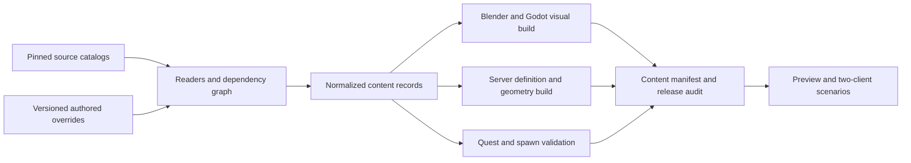

# Development, content automation and administration

This is a proposed implementation guide, not a claim that these tools exist.
The target is classic Metin2 presentation and pacing with maintainable,
measurable modern internals. Start from the working tools in this repository;
generalize them through representative fixtures before importing entire catalogs.
See the [master plan](../full-rebuild-plan.md) and [feature catalog](feature-catalog.md).

## What can already be reused

At project revision `d1b3bbdea24240e03e5e325549eb5c4bd01a377b`:

| Existing implementation | Useful foundation | Limit to remove deliberately |
| --- | --- | --- |
| `tools/metin_archive.py`: `Archive.inventory/get/resolve` | Pinned tree, Git blob validation, explicit virtual pack precedence, caching | One archive pin and selected-map storage conventions; no unified content graph |
| `tools/metin_gr2_adapter.py`, `blender_import_probe.py`, `blender_finish_import.py` | Legacy GR2 curves, bind placement, skeletal GLB export | One warrior, three meshes and four named clips; no general race/motion/equipment compiler |
| `tools/import_metin_map.py`, `metin_map_data.py`, `blender_map_convert.py` | Heights, placements, materials, terrain chunks and dependency resolution | Yongan fixtures; trees/effects unsupported; many content categories unparsed |
| `tools/metin_collision.py`, `bake_yongan.py` | Shared authoritative collision and visual walk surfaces | Yongan-specific bake; highest walk surface cannot represent independent overlapping floors |
| `tools/import_metin_ui.py`, `import_metin_intro.py` | Explicit UI fixture, pixel hashes, layout provenance | Selected screens/icons, no general locale/font/layout or full item catalog |
| `tools/generate_bindings.py` | Schema/SDK pins and generated client contract | Regenerates the protocol; does not generate gameplay or feature acceptance |
| `tools/export_playable.py`, `check_world_packs.py`, `deploy.py` | Isolated exports, package audits, streamed section dependencies, deployment preflight | Limited platforms, no broad content release manager or proven restore drill |
| `tools/test_accounts.py`, `test_browser_accounts.py`, UI/map suites | Real subscriptions, two accounts, exported Web/Linux input and screenshots | Specific existing slices, not a generic scenario recorder or population benchmark |
| Godot/Blender MCP, map and character previews | Interactive inspection, input and screenshots | Local developer instruments; they are not required by the game or its release pipeline |

Source paths above are repository-owned implementations, inspected for this plan.
They are not evidence that a generalized replacement has already been built.

## Content compiler contract

Keep source, normalized data, authored overrides and generated output distinct.
Use a small Python CLI orchestrator, pure format readers where possible, and
background Blender only for geometry/skeletal conversion. Godot builds and
checks final resources. A normal build must not depend on a particular open
Blender scene, MCP session, mouse macro or workstation path.

Each normalized record needs: stable content ID, source path and blob/SHA-256,
source revision/profile, reader version, dependency IDs, units/axes, schema
version, capability flags, applicable locale and explicit overrides. A build
key includes source hashes, dependency hashes, compiler and Blender/Godot versions,
target renderer/platform and settings. Do not use timestamps as content identity.
Keep a per-asset distribution/replacement manifest alongside hash provenance:
record the distribution basis and evidence, authored replacement or profile
exclusion for every selected dependency. Resolve unknown entries when qualifying
the production release; this proposed release contract does not change current
development export commands.
Generate a dependency report, missing-reference report, deterministic sorted
manifest and separate client/server payloads. Unknown required records fail the
selected content profile; experimental omissions need named entries and reasons.

The manifest should distinguish gameplay compatibility from presentation-only
updates. A visual texture fix should not require resetting characters; a changed
item definition or collision bake needs a versioned compatibility decision.
Use bounded output sizes, safe paths, finite numeric checks and enum/range checks
when parsing legacy records. Preserve unknown fields in inspection reports
until their semantics are understood; never silently substitute zero.

Proposed command families are design names, **not runnable commands today**:

| Proposed command family | Purpose and acceptance |
| --- | --- |
| `content inventory / explain <id>` | Enumerate files/records; explain why an asset was selected and which rules depend on it |
| `content import <profile> --dry-run / --offline` | Show exact downloads and rebuilds; a cached build works without network access |
| `content build <profile> --target web|linux|windows` | Produce immutable artifacts from one normalized source graph |
| `content validate / diff <old> <new>` | Catch ID reuse, removed references, changed formulas, collision/spawn mistakes, and package drift |
| `content preview <id> / scenario <name>` | Start isolated Godot scenes or two-client fixtures, with deterministic camera and capture |
| `content report / coverage` | Count converted, verified, unsupported and missing records separately |
| `content publish <manifest>` | Stage and activate an already validated content release through authorized deployment controls |

Start as CLI plus generated HTML/JSON reports. Add editor docks for repeated
work after the data contracts stabilize; building a general-purpose editor
before the compiler would duplicate effort.

## Animation and character automation

This is an early milestone, before scaling classes and equipment.

**GR2 is a source format only.** Offline tools read the original files and
Blender exports converted GLB geometry, skeletons and animation; Godot imports
those into its own resources. The player client does not load GR2 or depend on
Granny/Blender. MSA/MSM/MSS metadata is likewise normalized during the build
into Godot presentation data and trusted server action definitions. Package
audits must retain this boundary as the converter expands. Current conversion
evidence covers the warrior and four clips, not every legacy file variant.

1. Enumerate race/model definitions, shape/skin variants, hair, attachment bones,
   motion modes and named motions from the pinned metadata. Resolve `.msm`,
   `.msa`, motion lists, referenced `.gr2`, textures and `.msm` overrides by
   the selected archive's precedence rules. Record absent and duplicate paths.
2. Normalize rest/bind transforms, skeleton hierarchy, inverse binds, skin
   weights, model pivots, axes and units. Assign a skeleton signature. Share
   animation libraries only when signatures and motion semantics match;
   a similar bone count is insufficient evidence for retargeting.
3. Convert all selected clips with stable names and measured duration, loop
   boundaries and displacement. Preserve motion events separately: attack
   windows, combo links, movement locks, projectiles, sound, trails and effects.
   Sample/compress curves within measured position/angle tolerances. Do not
   infer damage timing from a filename or trust a client animation callback.
4. Compile trusted action definitions for the server: allowed equipment/mode,
   duration, combo transitions, hit windows, target shape/range, resource cost,
   interruption rules and cooldown. Both artifacts refer to the same action ID.
   Runtime damage still comes from server validation and state.
5. Generate Godot animation libraries/state-machine resources and attachment
   metadata outside hand-authored controllers. Let the controller choose
   motion based on authoritative activity and acknowledged action sequence.
   Keep root-motion presentation and authoritative displacement from being
   applied twice. Define correction behavior for interruptions and latency.
6. Generate contact sheets/video turntables, sampled bone/vertex probes,
   weapon-hand alignment overlays and bounds checks. Verify real deformation
   in Blender and Godot, then Web and native exports with the same fixture.
   Compare original-client observations when available; source conversion
   alone cannot establish visually indistinguishable playback.

Fixture matrix: male/female body variants, each classic class, one shared and
one different rig, one two-handed weapon, dual daggers, bow/projectile, bell/fan,
armour and hair change, rider+mount, an NPC, a nonhumanoid monster, death/revive,
skill, emote and wedding attire. Add later-class/pet rigs as extension fixtures.
Tests cover bind pose, extremes, loops, attachments and event timing, not just
whether an animation resource can be loaded.

Blender can inspect and convert most geometry/rig data, but an original engine's
effect script, SpeedTree asset or procedural material needs its own adapter or
an explicitly authored substitute. General Godot import customization and
animation import controls are described in the
[Godot import documentation](https://docs.godotengine.org/en/stable/tutorials/assets_pipeline/importing_3d_scenes/import_configuration.html).
Exact compatibility is tested with this project's pinned engine and fixtures.

## Other automation tracks

| Pipeline | Generate/validate | Human review that remains |
| --- | --- | --- |
| Maps and navigation | Settings, heights, texture indices/splats, water, placements, attributes, authored collision, terrain seams, walk graph/layers, portals, minimap/atlas, environment and ambient zones | Landmark alignment, camera occlusion, building clearance, bridge/underpass behavior, original atmosphere |
| Scenery and foliage | Property CRC resolution, instances, shared materials, LODs/impostors, bounded vegetation sway and collision classification | Silhouette/season fidelity; unsupported tree formats require a researched conversion path |
| Equipment and appearance | Item-to-model/icon mapping, slot/race/sex restrictions, shape changes, bones, trails/glows and tooltip inputs | Clipping, grip, silhouette and classic readability in crowded scenes |
| NPCs, mobs and spawns | Mob prototypes, groups, weighted groups, regen files, map-local coordinates, spawn/respawn rules, names, race/motions, AI parameters | Patrol/chase feel, spawn density, safe town boundaries and boss encounters |
| Items and economy | Item prototypes, sizes/stacks, limits/flags, sockets/attributes, upgrade recipes, shops, drops, currency bounds, expected-value and sink/source reports | Prices/drop balance, exploits, rare outcomes and progression pacing |
| Skills and affects | Skill prototypes, formula AST, learning tables, status stacking/dispel/immunity rules, descriptions/icons and motion links | Formula parity, PvE/PvP distinctions, cast responsiveness and understandable feedback |
| Quests and dungeons | Active quest lists/includes, event/API usage, dialogue/localization, flags/timers, item/NPC/map references, reward and branch graphs | Narrative intent, recoverability, full branch playthrough and unsupported script constructs |
| VFX and SFX | Effect dependency graph, particles/mesh/billboard/trail lifetimes, bone attachments, blend modes, sound events, ambient/BGM zones | Alpha/depth order, sound mix, classic timing and performance at density |
| UI/localization | Asset atlases, original image crops, selected layouts, text keys/placeholders, icon mappings, missing translations, input-action help | Font metrics, wrapping, focus/IME, tooltip timing, resolution scaling and exact classic layouts |
| Content releases | Chunk/payload hashes, dependency closures, signatures, size budgets, CDN cache keys and compatible client/server versions | Activation window, rollback decision and network/platform acceptance |

Do not automatically execute legacy Python UI or unrestricted quest Lua in the
client/server. For quests, first inventory the actually used syntax and APIs.
Prototype a declarative event/state/action representation with bounded timers,
transactions and persisted waits. Convert the supported subset and emit a
review queue for unsupported constructs. If scripting is necessary, make a
separate architecture decision with deterministic, budgeted execution and
explicit capabilities. A parser that accepts Lua is not quest parity.

## Developer tools

Deliver these along the gameplay systems they diagnose:

| Capability | Dependencies | Done means |
| --- | --- | --- |
| Content browser and dependency explorer | Stable IDs/manifests | Search model/item/skill/map/quest ID; see source, normalized record, output and reverse dependencies |
| Animation/equipment inspector | Motion compiler, appearance resolver | Scrub/blend clips, swap class/sex/gear, display bones/hit windows and capture identical frames |
| Map/spawn/portal editor overlays | Shared coordinates, world definitions | Inspect visual vs authoritative geometry, author versioned spawn/portal patches and validate reachability |
| Quest debugger and simulator | Quest state machine/event catalog | Inspect flags/waits/branches, drive bounded fixtures and reproduce a stuck quest without editing production rows |
| Combat/economy workbench | Formula engine, items, progression | Run seeded action traces, compare damage/XP/drop distributions and detect unintended table changes |
| Scenario runner | Auth, bindings, disposable test worlds | Two independent clients execute named scenarios with source/content/build evidence and cleanup ownership |
| Network impairment and replay tools | Sequenced intents/events, deterministic fixtures | Exercise delay, jitter, duplication, reconnect and subscription changes; distinguish simulation trace from client video |
| Performance/load lab | Metrics, bot clients, interest management | Measure declared crowd/entity mixes and budgets on known hardware; retain regressions per content version |
| UI reference gallery | Original layout evidence, render harness | Capture screens at fixed resolutions, compare spacing/pixels/focus and record accepted intentional differences |
| Schema/content migration planner | Version manifests, backups | Dry-run old snapshots, report invalid rows/IDs, rehearse recovery and prevent incompatible deployment |

Prefer command-line automation callable by CI and MCP. An editor dock should
invoke the same service/library, not maintain a second set of gameplay rules.
MCP remains local and absent from player exports. Performance/test clients use
normal authenticated intents by default; privileged fixtures are explicitly
authorized and isolated from public gameplay.

## Admin and live operations tools

Build a separate authenticated operator surface with server-enforced roles.
An invisible button or a secret chat command is not authorization. Initially
use a small CLI with structured requests and audit records; add a web console
when routine support/event workflows are understood. Never ship signing keys
or an unrestricted SQL console with the game.

| Surface | Operations | Required boundaries and evidence |
| --- | --- | --- |
| Account/support | Search exact account/character identifiers, inspect sessions, mute/ban/unban, recover access, review reports | Least-privilege views, reason/duration, actor identity, expiry, protected personal fields and appeal history |
| Character support | Inspect location, inventory provenance, quest/instance state; unstuck/relocate; repair a verified state problem | Validate destination and ownership; preview exact change, audit before/after and action ID; retries do not repeat grants |
| Economy investigations | Trace item creation/transfer/consumption and gold sources/sinks; detect duplication or abnormal funnels | Atomic transfers and append-only audit provenance; bounded searches; no silent item/gold edits |
| Content administration | Preview/release definitions, spawn patches, shop/drop schedules and localized notices | Versioned artifacts and compatibility checks; dry-run; restricted publication and rollback |
| Event control | Schedule rates, seasonal events, invasions, weddings/guild-war intervention, tournament rounds | Server time, named rules, idempotent start/stop, automatic expiry and recovery after restart |
| Moderation | Reports, scoped chat evidence, interaction blocks, sanctions, abusive names | Retention policy, access audit, rate limits; sanitization and safe rendering of user content |
| Server operations | Health, tick/transaction cost, connected accounts, maps/instances, bandwidth, slow reducers, content version, maintenance/drain | Metrics without credentials, alerts with actionable thresholds, scoped restart and rollback |
| Recovery | Backups of game and auth/key state, restore rehearsal, migration and content rollback | Explicit RPO/RTO targets; isolated restore and client verification; coordinated versions and keys |
| Permissions | Operator roles, separation of support/content/economy/deploy actions, emergency access | Backend authorization per action; short operator sessions/MFA; all privileged actions attributed and auditable |

Production operator policy also needs per-action amount/rate limits, expiring
emergency access and configurable second-operator approval for exceptional
high-impact grants, key changes or destructive repairs. Store audit evidence
under a separate permission boundary, with tamper detection and explicit
retention/export/redaction rules; an operator must not be able to erase their
own action trail. These are proposed product controls, not new approval steps
for the current development session.

Store schedule instants in UTC and record the display/business timezone.
Specify daylight-saving behavior, missed-run catch-up, overlapping runs,
cancellation and which deadlines advance while the server is offline. For
content signing, define the trusted keys on the receiving side, rotation and
revocation; a signature without trust validation is insufficient. Distinguish
rollback of an unchanged-compatible artifact from a schema/content migration
that needs forward repair rather than restoring incompatible definitions.

Account auth and game state are separate services. Email, billing, support
integration and external notifications belong behind an authenticated service
boundary; game reducers record an idempotent request/outbox when needed.
Persist retry/backoff state, dead-letter outcomes and reconciliation references;
operators need to see partial failures without repeating a completed grant.
Do not introduce an external microservice per gameplay system. Transactions,
roles and failure recovery matter more than the number of processes.

## Optimization with fidelity checks

Profile before changing representation. The current server performs several
whole-table scans (`combat::simulate`, `inventory::owned_items`, account/name
checks); indexes and active-region work are concrete next targets. Measure
scan/row counts, reducer duration, update frequency and bandwidth. Separate
private character state from public presence before adding inventories, guild
permissions and quests to a broad player row.

Use visible/static instance batching, spatial culling, distance-based animation
updates and measured LODs for the client. Cache shared rigs/materials and avoid
rebuilding equipment scenes per state update. Preserve opaque numeric texture
channels, original UI RGBA and alpha/material behavior; optimize with explicit
visual error bounds. Cap effect/label budgets by priority so nearby combat and
UI remain legible. Do not assume that native gains transfer to WebGL.

For browser delivery, measure initial core bytes and first playable scene,
stream nearby content with priority/cancellation/retries, bound memory/disk
caches, handle quota eviction and tab suspension, and recover from WebGL context
loss. The current single-threaded Compatibility export is the baseline; treat
threads/native extensions/other renderers as separate compatibility decisions.
Audio startup and browser background restrictions require real browser tests.
See [Godot Web export constraints](https://docs.godotengine.org/en/stable/tutorials/export/exporting_for_web.html).

Performance budgets must name target hardware, resolution, browser, RTT and
scene population. Suggested first experiments are 2/20/100 clients and a
separate dense-town scene; these are test tiers, **not promised capacity**.
Record frame percentiles, memory peak, download/entry time, bytes per client,
reducer cost and rejected/queued actions. Keep the present 50 ms simulation
until evidence justifies a change; preserve motion/cast timing when tuning it.

## Rollout order

First unify manifest/validation contracts and implement the motion/equipment
compiler with one original enemy fixture. Add definition/progression tools with
the first real combat loop, quest/spawn tools with the first town route, and
instance/social tools with their corresponding systems. Establish read-only
operator inspection and metrics early; audited repair/event controls arrive
before opening the economy/social features they can affect. Broaden batch
imports only after representative fixtures pass visual, gameplay and export
checks. The catalog tracks these deliverables independently so tooling cannot
be silently deferred until the end of the game.
